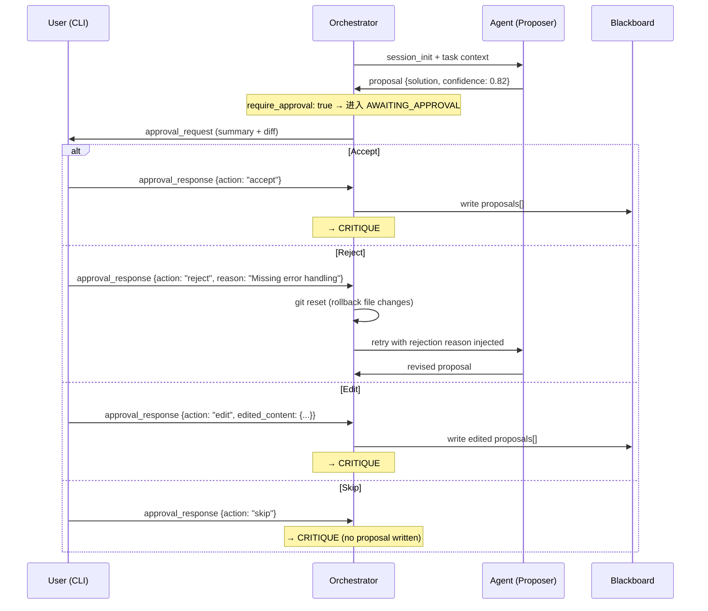
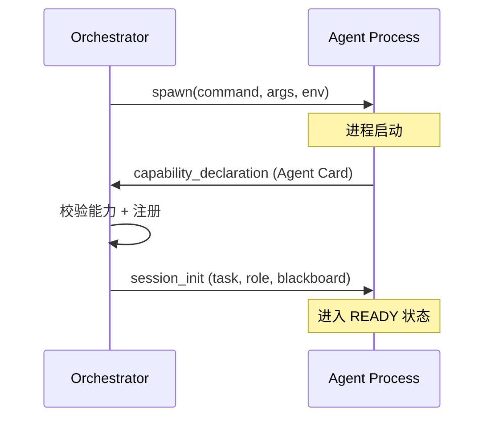
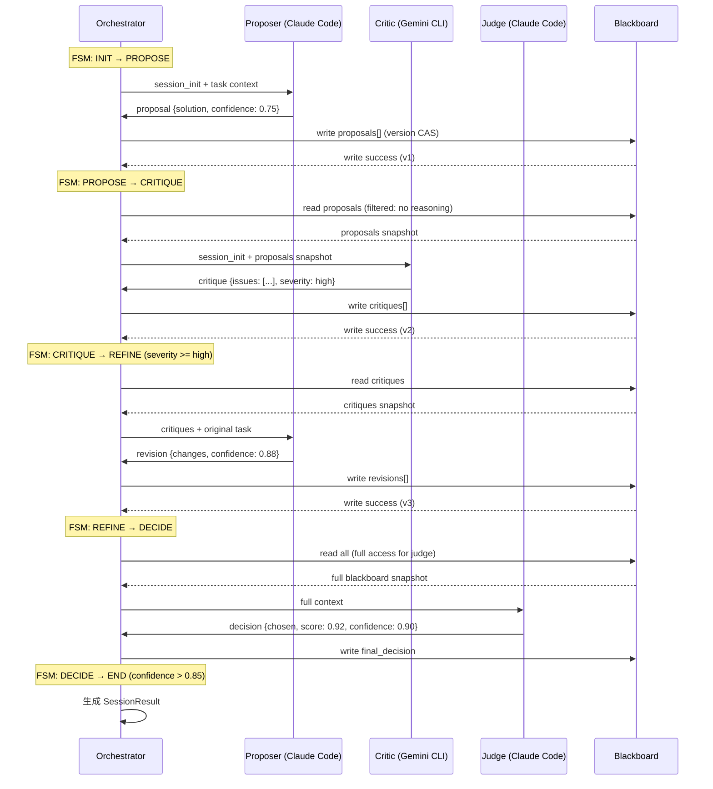
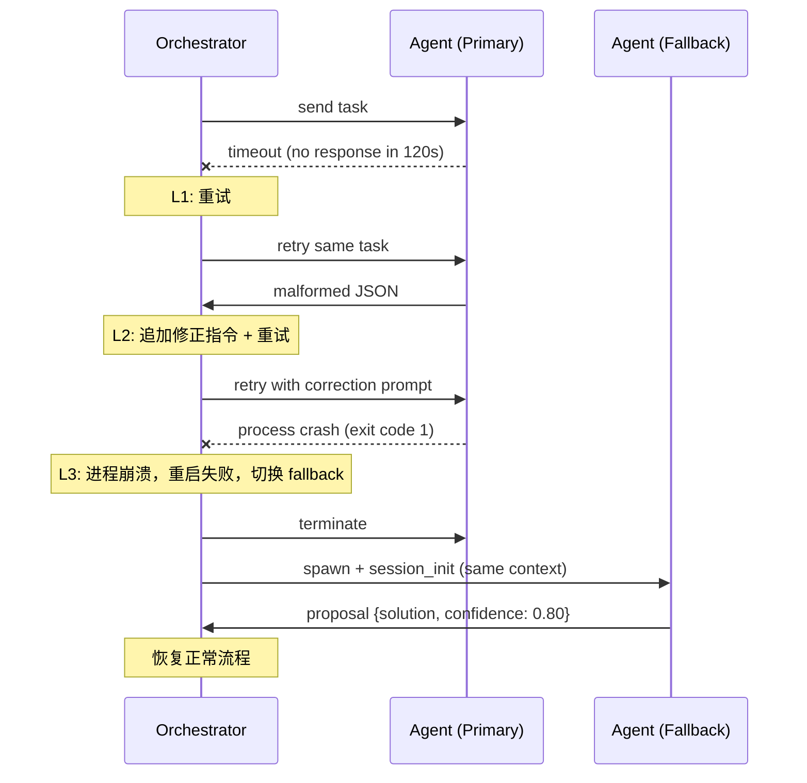
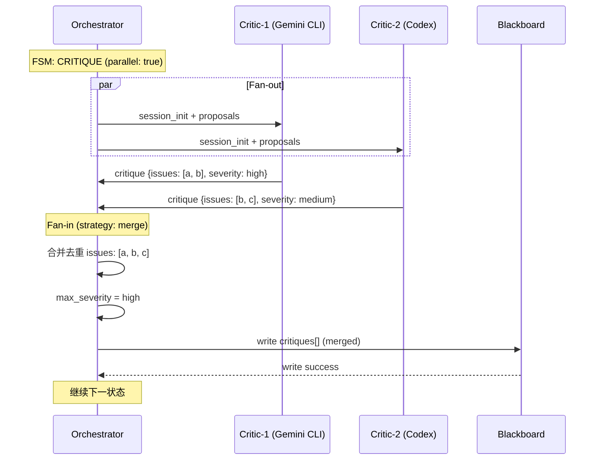

# 多智能体协作系统（Local Harness 编排方案）

> 定位：本地多智能体运行时（Agent Runtime）的技术方案文档，负责 Agent 进程管理、消息传输、状态同步。
> 与上层 harness 编排方案为上下层关系，本文档聚焦运行时底座。

---

## 一、目标

构建一个本地可控的多智能体协作系统，在 harness 约束下，实现：

- 多角色协作（正方 / 反方 / 决策）
- 共享上下文 + 局部隔离
- 强制结构化输出
- 可配置流程编排
- 可控终止机制
- 防止共识偏移（Groupthink）
- 可观测、可复现、可扩展

### 技术选型决策

| 决策 | 选择 | 理由 |
|------|------|------|
| Agent 间通信 | 自定义协议（非 Google A2A） | 本地子进程不需要 HTTP；需精细控制进程生命周期；需成本感知能力 |
| 传输方式 | subprocess stdin/stdout | 最简方案；CLI 工具天然支持；无网络开销 |
| 消息帧格式 | NDJSON（Newline-Delimited JSON） | 人类可读；调试方便；流式兼容 |
| 编排模型 | FSM（有限状态机）+ 配置驱动 | 可预测、可调试、可可视化 |
| 目标 Agent | Claude Code / Codex / Gemini CLI / OpenCode | 覆盖主流本地 AI 编码工具 |

---

## 二、系统总体架构

### 分层架构

```
┌─────────────────────────────────────────────────────────┐
│  Layer 4: Flow Layer                                    │
│  FSM 编排 · 流程配置 · 终止判定 · 角色调度              │
├─────────────────────────────────────────────────────────┤
│  Layer 3: Protocol Layer                                │
│  消息格式 · 消息类型 · JSON Schema 校验                  │
├─────────────────────────────────────────────────────────┤
│  Layer 2: Transport Layer                               │
│  NDJSON over stdin/stdout · 心跳 · 帧分割               │
├─────────────────────────────────────────────────────────┤
│  Layer 1: Adapter Layer                                 │
│  Claude Code · Codex · Gemini CLI · OpenCode 进程管理    │
└─────────────────────────────────────────────────────────┘
```

### 组件关系

```
            ┌──────────────────┐
            │   Orchestrator   │
            │  (FSM 调度器)     │
            └────────┬─────────┘
                     │ dispatch / collect
    ┌────────────────┼────────────────┐
    │                │                │
    ▼                ▼                ▼
┌────────┐    ┌──────────┐    ┌────────┐
│Proposer│    │  Critic  │    │ Judge  │
│(提方案) │    │ (质疑)    │    │(决策)  │
└───┬────┘    └────┬─────┘    └───┬────┘
    │              │              │
    └──────────────┼──────────────┘
                   ▼
           ┌──────────────┐
           │  Blackboard  │
           │ (共享状态)     │
           └──────┬───────┘
                  ▼
           ┌──────────────┐
           │Memory System │
           └──────────────┘
```

### 与上层 harness 的接口边界

本文档（运行时层）负责：进程管理、消息传输、Blackboard 读写、L1-L3 错误处理、资源限制。

上层 harness 负责：任务分解、`failure_policy`、`context.handoff`、`gate`（质量门禁）、L4 逻辑错误处理。

两层通过 Orchestrator 的 API 对接：harness 下发 FlowConfig + TaskContext，运行时执行并返回 SessionResult。

---

## 三、Agent 接入层（Adapter Layer）

### 3.1 Adapter 抽象接口

```typescript
interface IAgentAdapter {
  /** 启动 agent 子进程 */
  spawn(config: AgentAdapterConfig): Promise<AgentProcess>;

  /** 运行模式：single-shot (短连接) | long-running (长连接/MCP) */
  mode: "single-shot" | "long-running";

  /** 向 agent stdin 写入消息 */
  send(process: AgentProcess, message: AgentMessage): Promise<void>;

  /** 从 agent stdout 读取消息流 */
  receive(process: AgentProcess): AsyncIterable<AgentMessage>;

  /** 终止 agent 进程 */
  terminate(process: AgentProcess, graceful?: boolean): Promise<void>;
}
```

### 3.2 性能优化：持久化会话 (Persistent Session)

为了解决 `single-shot` 模式下进程启动慢和上下文重复发送的问题，系统优先支持 **MCP (Model Context Protocol)**：

1. **进程复用**：在同一 Session 内，Orchestrator 维持 Agent 进程不退出，通过 stdio 进行多轮对话。
2. **上下文增量更新**：仅向 Agent 发送自上一轮以来的 Blackboard 增量变化（Delta），降低 Token 消耗。
3. **预热机制**：FSM 进入 `INIT` 时，并行预热 `proposer` 和 `critic` 对应的进程。

#### 3.2.1 长连接多轮消息帧

长连接模式下，同一进程会接收多轮任务。通过 `round_context` 消息区分"新轮次"与"补充信息"：

```json
// 新轮次开始（区别于 session_init，不需要重新握手）
{
  "type": "round_start",
  "session_id": "sess_abc123",
  "round": 2,
  "assigned_role": "proposer",
  "delta": { ... },
  "full_context": false
}
```

| 字段 | 说明 |
|------|------|
| `round` | 轮次号，递增，Agent 据此感知"这是新任务" |
| `delta` | Blackboard 增量（见 3.2.2），仅含上一轮以来的变化 |
| `full_context` | `true` 时携带完整 Blackboard 快照（用于进程恢复后的状态同步） |

#### 3.2.2 Blackboard Delta 消息格式

增量更新的 Delta 描述自上一版本以来 Blackboard 的变化：

```json
{
  "type": "blackboard_delta",
  "from_version": 2,
  "to_version": 3,
  "changes": [
    {
      "op": "append",
      "field": "critiques",
      "value": {
        "id": "msg_005",
        "role": "critic",
        "type": "critique",
        "content": { "issues": [...], "severity": "high", "summary": "..." },
        "confidence": 0.78
      }
    },
    {
      "op": "update",
      "field": "meta",
      "path": "confidence",
      "value": 0.78
    }
  ]
}
```

| op | 适用场景 | 说明 |
|----|----------|------|
| `append` | 向数组字段追加 | proposals / critiques / revisions |
| `set` | 替换字段值 | final_decision |
| `update` | 更新嵌套路径 | meta 内的子字段 |

**Fallback 规则**：如果 Agent 因长时间 idle 被重新激活，或 Delta 链断裂（`from_version` 不匹配），Orchestrator 发送 `full_context: true` 的完整快照而非 Delta。

---

## 四、传输协议（Transport Protocol）

### 4.1 传输层设计与鲁棒性

| 属性 | 说明 |
|------|------|
| 传输方式 | subprocess stdin/stdout |
| 噪音过滤 | **启发式 JSON 提取器**（见 4.1.1） |
| 强制 Headless | 在 System Prompt 中注入指令，要求 Agent 仅输出单行 NDJSON。 |
| 编码 | 统一 UTF-8 |

#### 4.1.1 启发式 JSON 提取器（Heuristic JSON Extractor）

Agent CLI 工具的 stdout 通常夹杂非结构化噪音（ANSI 颜色码、版本更新提示、进度条、调试日志等）。提取器负责从中可靠地恢复出结构化 JSON。

**处理管线（Pipeline）**：

```
Raw stdout
  → Step 1: ANSI 转义序列剥离（正则 /\x1B\[[0-9;]*[a-zA-Z]/g）
  → Step 2: 按行分割（\n）
  → Step 3: 逐行尝试 JSON.parse()
  → Step 4: 若整行解析成功 → 输出
  → Step 5: 若整行解析失败 → 括号匹配提取
  → Step 6: 若仍失败 → 记录到 trace log，跳过
```

**括号匹配提取（Step 5）规则**：

| 场景 | 处理方式 |
|------|----------|
| 行内包含完整 JSON 对象 | 从第一个 `{` 开始，使用括号计数器（`depth++` on `{`，`depth--` on `}`），`depth == 0` 时截断，提取子串并 `JSON.parse()` |
| 行内有多个独立 JSON 对象 | 提取第一个完整对象，剩余部分递归处理 |
| JSON 字符串内的 `{}` | 括号匹配时跟踪引号状态（`"` toggle），字符串内的 `{}` 不计入深度 |
| 转义引号 `\"` | 识别转义序列，不误触 toggle |
| 跨行 JSON（如 Agent 输出了多行格式化 JSON） | 累积缓冲区，逐行追加直到括号平衡或超过 1MB 上限 |

**ANSI 剥离顺序**：必须在 JSON 解析之前执行。ANSI 码可能出现在 JSON 值的中间（如 `{"solution": "\x1B[32mfix\x1B[0m"}`），先剥离可避免解析错误。

**失败 Fallback**：

| 失败情况 | 处理 |
|----------|------|
| 单行无法提取有效 JSON | 记入 trace log（`status: "noise"`），继续等待下一行 |
| 连续 N 行（默认 50）无有效 JSON | 触发 L2 error，向 Agent 追加修正指令要求输出纯 JSON |
| 超过 timeout 仍无有效输出 | 触发 L1 timeout 处理 |

### 4.2 消息帧格式（Framing）

采用 **NDJSON**（Newline-Delimited JSON）：每条消息为单行合法 JSON，以 `\n` 结尾。

```
{"id":"msg_001","type":"proposal","role":"proposer","content":{"solution":"..."},"confidence":0.8}\n
{"id":"msg_002","type":"critique","role":"critic","content":{"issues":["..."]},"confidence":0.7}\n
```

#### 边界条件

| 约束 | 值 | 说明 |
|------|----|------|
| 单条消息上限 | 1MB | 超出则拒绝该消息，返回 L2 error 并要求 Agent 精简输出 |
| 换行处理 | JSON 序列化保证无裸换行 | `\n` 在字符串内编码为 `\\n` |
| 空行 | 忽略 | 允许心跳探测发空行 |
| 非 JSON 行 | 记录到 trace log，跳过 | 容忍 agent 的非结构化输出 |

#### 备选方案：Length-Prefix

```
[4 bytes: payload length, big-endian uint32][payload bytes]
```

取舍：更可靠（可处理二进制），但调试不友好、CLI 工具不天然支持。**MVP 阶段不采用**。

### 4.3 握手协议（Handshake）

对于长连接模式（MCP Server stdio），Agent 启动后第一条消息必须为 `capability_declaration`：

```json
{
  "type": "capability_declaration",
  "agent": {
    "name": "claude-code",
    "model": "claude-sonnet-4-20250514",
    "supported_roles": ["proposer", "critic", "judge"],
    "max_output_tokens": 16000
  }
}
```

Orchestrator 验证后回复 `session_init`：

```json
{
  "type": "session_init",
  "session_id": "sess_abc123",
  "task": "Review the authentication module for security issues",
  "assigned_role": "critic",
  "blackboard_snapshot": { ... },
  "constraints": {
    "max_rounds": 5,
    "output_schema": "critique"
  }
}
```

- 握手超时：10 秒
- 握手失败：走 L3 错误处理（参见第十二章）

对于 single-shot 模式，无需握手。Orchestrator 将 session context + prompt 拼接后作为参数传入。

### 4.4 心跳与存活检测

仅适用于长连接模式：

| 参数 | 值 |
|------|----|
| 心跳间隔 | 30 秒 |
| 心跳超时 | 10 秒 |
| 最大连续失败 | 3 次 |
| 检测方式 | `ping` / `pong` + `process.exitCode` 双重检测 |

```json
// Orchestrator → Agent
{"type": "ping", "timestamp": "2026-04-03T10:00:00Z"}

// Agent → Orchestrator
{"type": "pong", "timestamp": "2026-04-03T10:00:01Z"}
```

对于 single-shot 模式，通过进程退出码 + timeout 检测存活。

---

## 五、Agent 注册与能力声明（Agent Registry）

### 5.1 Agent Card 数据结构

```json
{
  "name": "claude-code",
  "version": "1.0.0",
  "model": "claude-sonnet-4-20250514",
  "provider": "anthropic",
  "supported_roles": ["proposer", "critic", "judge"],
  "capabilities": ["code_generation", "code_review", "reasoning", "web_search"],
  "tools": ["file_read", "file_write", "bash", "grep", "glob"],
  "constraints": {
    "max_context_window": 200000,
    "max_output_tokens": 16000,
    "supported_languages": ["zh", "en"]
  },
  "cost_profile": {
    "input_cost_per_1k_tokens": 0.003,
    "output_cost_per_1k_tokens": 0.015,
    "currency": "USD"
  },
  "latency_profile": {
    "avg_response_ms": 5000,
    "p99_response_ms": 30000
  }
}
```

### 5.2 本地注册表（agents.yaml）

```yaml
agents:
  claude-code:
    card:
      model: "claude-sonnet-4-20250514"
      provider: anthropic
      supported_roles: [proposer, critic, judge]
      capabilities: [code_generation, code_review, reasoning]
      cost_profile:
        input_cost_per_1k_tokens: 0.003
        output_cost_per_1k_tokens: 0.015
    adapter: claude-code  # 引用 adapters 配置

  codex:
    card:
      model: "codex"
      provider: openai
      supported_roles: [proposer, critic]
      capabilities: [code_generation, code_review]
      cost_profile:
        input_cost_per_1k_tokens: 0.002
        output_cost_per_1k_tokens: 0.010
    adapter: codex

  gemini-cli:
    card:
      model: "gemini-2.5-pro"
      provider: google
      supported_roles: [proposer, critic]
      capabilities: [code_generation, reasoning, web_search]
      cost_profile:
        input_cost_per_1k_tokens: 0.001
        output_cost_per_1k_tokens: 0.004
    adapter: gemini-cli

  opencode:
    card:
      model: "configurable"
      provider: multiple
      supported_roles: [proposer, critic]
      capabilities: [code_generation]
      cost_profile:
        input_cost_per_1k_tokens: 0.002
        output_cost_per_1k_tokens: 0.010
    adapter: opencode
```

### 5.3 Agent 选择策略

角色到 Agent 的映射规则（按优先级）：

1. **显式配置** — FlowConfig 中直接指定 `agent: claude-code`
2. **能力匹配** — 根据 `supported_roles` + `capabilities` 自动匹配
3. **成本优化** — 同等能力下选择 `cost_profile` 更低的 Agent
4. **降级策略** — 首选不可用时切换备选

```yaml
# 在 flow 配置中的映射示例
role_mapping:
  proposer:
    primary: claude-code
    fallback: [codex, gemini-cli]
  critic:
    primary: gemini-cli       # 异构模型，防止同源偏见
    fallback: [codex, opencode]
  judge:
    primary: claude-code
    fallback: [gemini-cli]
```

---

## 六、核心协议（Agent Protocol）

### 6.1 消息格式

```json
{
  "protocol_version": "1.0",
  "id": "msg_001",
  "session_id": "sess_abc123",
  "round": 1,
  "timestamp": "2026-04-03T10:00:00Z",
  "role": "proposer",
  "type": "proposal",
  "parent_id": null,
  "content": {},
  "confidence": 0.82,
  "terminate": false,
  "metadata": {
    "agent_name": "claude-code",
    "model": "claude-sonnet-4-20250514",
    "token_usage": {
      "input": 1200,
      "output": 800
    },
    "latency_ms": 3500
  }
}
```

### 6.2 字段说明

| 字段 | 类型 | 必填 | 说明 |
|------|------|------|------|
| `protocol_version` | string | 是 | 协议版本，当前 `"1.0"` |
| `id` | string | 是 | 消息唯一标识，格式 `msg_xxx` |
| `session_id` | string | 是 | 会话标识，格式 `sess_xxx` |
| `round` | number | 是 | 当前轮次，从 1 开始 |
| `timestamp` | string | 是 | ISO 8601 时间戳 |
| `role` | enum | 是 | `proposer` / `critic` / `judge` |
| `type` | enum | 是 | 消息类型（见 6.3） |
| `parent_id` | string? | 否 | 回复目标消息 ID，支持评论式线程结构 |
| `content` | object | 是 | 消息体，schema 由 type 决定 |
| `confidence` | number | 是 | 0.0-1.0，用于收敛判断 |
| `terminate` | boolean | 是 | 建议结束当前流程 |
| `metadata` | object | 否 | 可扩展元数据（token 用量、延迟等） |

### 6.3 消息类型完整枚举

#### 系统消息（Orchestrator 发出）

| type | 方向 | 说明 |
|------|------|------|
| `session_init` | Orch → Agent | 会话初始化，携带任务和上下文 |
| `ping` | Orch → Agent | 心跳探测 |
| `terminate_request` | Orch → Agent | 请求终止 |
| `error` | 双向 | 错误通知 |
| `approval_request` | Orch → CLI | 请求人工审批（参见 9.2.6） |
| `approval_response` | CLI → Orch | 审批结果（accept/reject/edit/skip） |
| `round_start` | Orch → Agent | 长连接模式下新轮次开始（参见 3.2.1） |
| `blackboard_delta` | Orch → Agent | Blackboard 增量更新（参见 3.2.2） |

#### 握手消息（长连接模式）

| type | 方向 | 说明 |
|------|------|------|
| `capability_declaration` | Agent → Orch | Agent 能力声明 |
| `capability_ack` | Orch → Agent | 能力确认 |

#### 业务消息（Agent 发出）

| type | content schema | 说明 |
|------|----------------|------|
| `proposal` | `{ solution: string, reasoning: string, alternatives?: string[] }` | 提出方案 |
| `critique` | `{ issues: Issue[], severity: "low"\|"medium"\|"high"\|"critical", summary: string }` | 质疑/评审 |
| `revision` | `{ changes: string, addressed_issues: string[], reasoning: string }` | 修订方案 |
| `decision` | `{ chosen: string, rationale: string, score: number, dissent?: string }` | 最终决策 |

#### 响应消息

| type | 方向 | 说明 |
|------|------|------|
| `pong` | Agent → Orch | 心跳响应 |
| `terminate_ack` | Agent → Orch | 终止确认 |

### 6.4 消息校验

Orchestrator 收到每条消息后立即校验：

1. **格式校验** — 合法 JSON、必填字段存在
2. **类型校验** — `type` + `role` 组合合法（如 critic 不能发 `proposal`）
3. **Schema 校验** — `content` 符合对应 type 的 schema
4. **权限校验** — 该 agent 有权发此类消息

校验失败处理：记录到 trace log，走 L2 错误处理（参见第十二章）。

---

## 七、角色设计（Role-based Agents）

### 7.1 核心角色

| 角色 | 职责 | 可发消息类型 |
|------|------|-------------|
| `proposer` | 提出方案、回应质疑、修订方案 | `proposal` / `revision` |
| `critic` | 找问题、评估风险、提出反对意见（必须存在） | `critique` |
| `judge` | 综合评估、做最终决策 | `decision` |

### 7.2 角色与 Agent 的 N:M 映射

- 一个 Agent 可扮演多个角色（如 Claude Code 同时可做 proposer 和 judge）
- 一个角色可由多个 Agent 竞争执行（如两个 critic 并行评审）
- 同一 session 中，同一 Agent 不应同时担任 proposer 和 critic（防止自我评审）

### 7.3 角色切换规则

角色在 `session_init` 时分配，session 内不可变。需要不同角色时启动新的 Agent 进程。

---

## 八、Blackboard（共享状态）

### 8.1 数据结构

```json
{
  "task": {
    "description": "Review the authentication module for security issues",
    "context": {},
    "constraints": {}
  },
  "proposals": [],
  "critiques": [],
  "revisions": [],
  "final_decision": null,
  "meta": {
    "session_id": "sess_abc123",
    "round": 0,
    "confidence": 0.0,
    "created_at": "2026-04-03T10:00:00Z",
    "updated_at": "2026-04-03T10:00:00Z",
    "version": 0
  }
}
```

### 8.2 写入约束

| Agent | 可写字段 | 不可写字段 |
|-------|---------|-----------|
| proposer | `proposals` / `revisions` | `critiques` / `final_decision` |
| critic | `critiques` | `proposals` / `revisions` / `final_decision` |
| judge | `final_decision` | `proposals` / `critiques` / `revisions` |

禁止跨字段写入，Orchestrator 在写入前强制校验。

### 8.3 读取约束（支持 Context Isolation）

| Agent | 可读字段 | 不可读字段 |
|-------|---------|-----------|
| proposer | 全部 | 无 |
| critic | `task` / `proposals`（仅结果） | proposer 的 `reasoning` 字段 |
| judge | 全部 | 无 |

critic 只能看到 proposal 的结果，看不到推理过程，防止被 proposer 的论证带偏。

### 8.4 状态同步与写控制

| 策略 | 说明 |
|------|------|
| 并发模型 | **令牌机制 (Token-based Write) + 乐观锁版本校验**：同一时刻仅允许一个 Agent 写入 Blackboard 对应字段（由 FSM 状态机调度保证互斥）；写入时携带 `expected_version` 做版本校验，防止并行步骤（fan-out）中的竞态条件。 |
| 实时广播 | 当 Blackboard 发生更新，Orchestrator 实时同步快照给所有长连接（MCP）Agent。 |

### 8.5 评分机制

- critique 消息携带 `severity`（low / medium / high / critical）
- judge decision 携带 `score`（0.0-1.0）
- Blackboard `meta.confidence` 由 Orchestrator 根据最新 score 更新

---

## 九、流程编排（Flow Orchestration）

### 9.1 FSM 状态机

#### 状态定义

| 状态 | 说明 |
|------|------|
| `INIT` | 加载配置、预热 Agent 进程 |
| `PROPOSE` | Proposer 生成方案 |
| `CRITIQUE` | Critic 评审方案 |
| `REFINE` | Proposer 根据 Critique 修订 |
| `DECIDE` | Judge 做最终决策 |
| `AWAITING_APPROVAL` | 暂停流程，等待人工审批 |
| `END` | 流程结束，生成 SessionResult |

#### 状态转移规则

```
INIT → PROPOSE → CRITIQUE → REFINE (if severity >= threshold)
                          → DECIDE (if severity < threshold)
REFINE → CRITIQUE (loop) / DECIDE
DECIDE → END (if confidence >= threshold)
       → PROPOSE (new round, if confidence < threshold)

任意可审批状态 → AWAITING_APPROVAL → 原状态的下一跳 (Accept)
                                   → 原状态 (Edit, 带修正内容重跑)
                                   → ROLLBACK → 原状态 (Reject, 回滚后重跑)
```

### 9.2 Human-in-the-Loop（人工介入）

#### 9.2.1 触发机制

在流程步骤中引入 `require_approval` 配置，支持三种触发模式：

| 模式 | 配置值 | 说明 |
|------|--------|------|
| 关闭 | `false`（默认） | 全自动执行 |
| 步骤后审批 | `true` | Agent 输出结果后、写入 Blackboard 前暂停 |
| 文件变更审批 | `"on_file_change"` | 仅当 Agent 修改了本地文件系统时触发 |

```yaml
steps:
  - state: PROPOSE
    agent: proposer
    timeout_ms: 60000
    require_approval: true          # 每次 proposal 都需审批

  - state: DECIDE
    agent: judge
    timeout_ms: 60000
    require_approval: "on_file_change"  # 仅文件变更时审批
```

#### 9.2.2 审批交互流程

当进入 `AWAITING_APPROVAL` 状态时，Orchestrator 通过 CLI 展示审批界面：

```
╔══════════════════════════════════════════════════╗
║  🔍 Approval Required — PROPOSE (Round 2)       ║
╠══════════════════════════════════════════════════╣
║  Agent: claude-code (proposer)                   ║
║  Confidence: 0.82                                ║
║                                                  ║
║  Summary: Refactored auth middleware to use JWT   ║
║                                                  ║
║  Files Changed:                                  ║
║    M src/auth/middleware.ts  (+42, -18)           ║
║    A src/auth/jwt-validator.ts  (+67)             ║
║                                                  ║
║  [D]iff  [A]ccept  [R]eject  [E]dit  [S]kip     ║
╚══════════════════════════════════════════════════╝
```

#### 9.2.3 用户操作与后续流程

| 操作 | 快捷键 | 行为 | FSM 转移 |
|------|--------|------|----------|
| **Diff** | `D` | 展示完整 diff（文件变更时）或 Agent 输出详情 | 停留在 `AWAITING_APPROVAL` |
| **Accept** | `A` | 接受结果，写入 Blackboard，继续 | → 下一状态 |
| **Reject** | `R` | 拒绝结果，回滚文件变更（git checkpoint），向 Agent 发送 rejection 理由重跑 | → 回滚 → 重跑当前步骤 |
| **Edit** | `E` | 打开 `$EDITOR` 让用户手动修改 Agent 输出 JSON 或文件，修改后作为最终结果写入 Blackboard | → 下一状态 |
| **Skip** | `S` | 跳过当前步骤，不写入 Blackboard | → 下一状态 |

#### 9.2.4 审批超时

| 参数 | 默认值 | 说明 |
|------|--------|------|
| `approval_timeout_ms` | `300000`（5 分钟） | 等待用户响应的最大时长 |
| `approval_timeout_action` | `pause` | 超时后的默认行为 |

超时行为选项：

| 行为 | 说明 |
|------|------|
| `pause` | 持续等待，仅打印提醒（默认） |
| `accept` | 自动接受（适用于低风险步骤） |
| `abort` | 终止整个 session |

```yaml
steps:
  - state: PROPOSE
    agent: proposer
    require_approval: true
    approval_timeout_ms: 600000       # 10 分钟
    approval_timeout_action: pause    # 超时后继续等待
```

#### 9.2.5 Reject 重试限制

| 参数 | 默认值 | 说明 |
|------|--------|------|
| `max_rejections` | `3` | 同一步骤最大连续 reject 次数 |
| `on_max_rejections` | `abort` | 达到上限后的行为（`abort` / `skip`） |

用户连续 reject 超过上限时，Orchestrator 终止当前步骤，避免无限循环。

#### 9.2.6 审批协议消息

新增两种系统消息用于记录审批过程：

```json
// Orchestrator → CLI（请求审批）
{
  "type": "approval_request",
  "session_id": "sess_abc123",
  "step_state": "PROPOSE",
  "round": 2,
  "agent_name": "claude-code",
  "result_preview": { "solution": "...", "confidence": 0.82 },
  "files_changed": [
    { "path": "src/auth/middleware.ts", "action": "modified", "additions": 42, "deletions": 18 }
  ],
  "timestamp": "2026-04-03T10:05:00Z"
}

// CLI → Orchestrator（审批结果）
{
  "type": "approval_response",
  "session_id": "sess_abc123",
  "action": "accept",
  "reason": null,
  "edited_content": null,
  "user": "yang.zhou",
  "timestamp": "2026-04-03T10:05:30Z"
}
```

`action` 枚举：`accept` | `reject` | `edit` | `skip`

当 `action == "reject"` 时，`reason` 必填，会注入到下一轮 Agent prompt 中：

```
The user rejected your previous output for the following reason:
"{reason}"
Please revise your approach and try again.
```

当 `action == "edit"` 时，`edited_content` 携带用户修改后的内容。

### 9.3 基础 YAML 配置

```yaml
flow:
  name: "default-debate"
  max_rounds: 5

  steps:
    - state: PROPOSE
      agent: proposer
      timeout_ms: 60000

    - state: CRITIQUE
      agent: critic
      repeat: 2
      timeout_ms: 60000

    - state: REFINE
      agent: proposer
      condition: "critic_max_severity >= high"
      timeout_ms: 60000

    - state: DECIDE
      agent: judge
      timeout_ms: 60000

    - state: END
```

### 9.4 并发执行

#### Fan-out / Fan-in

多个 agent 并行执行同一步骤，结果汇总后进入下一状态：

```yaml
steps:
  - state: CRITIQUE
    parallel: true
    agents:
      - critic-1   # gemini-cli
      - critic-2   # codex
    fan_in: merge   # merge | vote | first
    timeout_ms: 90000
```

| fan_in 策略 | 说明 |
|-------------|------|
| `merge` | 合并所有 critique 到 Blackboard |
| `vote` | 多数意见决定（适用于 decision） |
| `first` | 采用最先返回的结果 |

#### 条件分支

```yaml
steps:
  - state: REFINE
    agent: proposer
    condition: "critic_max_severity >= high"
    # 条件不满足时跳过，直接进入下一 state
```

#### 循环

```yaml
steps:
  - state: CRITIQUE
    agent: critic
    repeat: 3                     # 最多重复 3 次
    break_condition: "new_issues == 0"  # 无新问题时提前退出
```

### 9.5 完整 FlowConfig 字段

```yaml
flow:
  name: string           # 流程名称
  description: string    # 流程描述
  max_rounds: number     # 硬终止：最大轮次

  role_mapping:          # 角色 → Agent 映射
    proposer:
      primary: string
      fallback: [string]
    critic:
      primary: string
      fallback: [string]
    judge:
      primary: string
      fallback: [string]

  termination:           # 终止条件（参见第十一章）
    max_rounds: number
    convergence_epsilon: number
    min_confidence: number

  steps:                 # 步骤列表
    - state: string
      agent: string | [string]
      parallel: boolean
      fan_in: merge | vote | first
      repeat: number
      condition: string
      break_condition: string
      timeout_ms: number
      on_error: retry | skip | abort
      on_timeout: retry | skip | abort
      require_approval: boolean | "on_file_change"   # Human-in-the-Loop
      approval_timeout_ms: number                     # 审批超时（默认 300000）
      approval_timeout_action: pause | accept | abort # 超时行为（默认 pause）
      max_rejections: number                          # 最大连续 reject 次数（默认 3）
      inquiry:                                         # 追问模式（仅 CRITIQUE 步骤）
        enabled: boolean
        threshold: number                              # critic confidence 阈值（默认 0.5）
        max_rounds: number                             # 最多追问次数（默认 1）
        release_fields: [string]                       # 释放的隔离字段
```

### 9.6 条件表达式语言（Condition Expression）

`condition` 和 `break_condition` 字段使用一种简单的表达式 DSL，在 Orchestrator 内部求值。

#### 可用变量

所有变量从当前 Blackboard 状态派生：

| 变量名 | 类型 | 来源 | 说明 |
|--------|------|------|------|
| `round` | number | `blackboard.meta.round` | 当前轮次 |
| `confidence` | number | `blackboard.meta.confidence` | 当前置信度 |
| `critic_max_severity` | enum | 最新一轮 critiques 中的最高 severity | 可比较：`low < medium < high < critical` |
| `critic_issue_count` | number | 最新一轮 critiques 中的 issue 总数 | — |
| `new_issues` | number | 相比上一轮新增的 issue 数量 | 用于收敛判断 |
| `score` | number | 最新 decision 的 score | — |
| `score_delta` | number | `|score_t - score_(t-1)|` | 分数变化绝对值 |
| `proposals_count` | number | `blackboard.proposals.length` | — |
| `revisions_count` | number | `blackboard.revisions.length` | — |

#### 支持的操作符

| 操作符 | 示例 | 说明 |
|--------|------|------|
| `==`, `!=` | `new_issues == 0` | 相等/不等 |
| `>`, `>=`, `<`, `<=` | `confidence >= 0.85` | 数值比较 |
| `&&`, `\|\|` | `new_issues == 0 \|\| confidence > 0.90` | 逻辑与/或 |
| `!` | `!terminate` | 逻辑非 |

Severity 枚举的比较按顺序：`low(1) < medium(2) < high(3) < critical(4)`。

#### 实现方式

MVP 阶段使用安全的表达式解析器（如 [expr-eval](https://github.com/silentmatt/expr-eval)），**禁止使用 `eval()`**。不支持函数调用、属性访问或任意 JavaScript。

### 9.7 HITL 时序图



---

## 十、Adapter 配置（adapters.yaml）

定义各 Agent CLI 工具的启动命令、参数和运行环境。

### Schema

```yaml
adapters:
  <adapter_name>:
    command: string              # 可执行文件路径或命令名
    args: [string]               # 启动参数模板
    mode: single-shot | long-running
    env:                         # 环境变量（支持 ${VAR} 引用系统环境变量）
      KEY: value
    workdir: string              # 工作目录（默认 ${PROJECT_ROOT}）
    timeout_ms: number           # 单次调用超时
    max_retries: number          # 重试次数
    health_check_interval_ms: number  # 心跳间隔（仅 long-running）
    system_prompt_override: string    # 覆盖默认 system prompt（可选）
    resource_limits:
      max_memory_mb: number
      max_cpu_percent: number
```

### 默认配置

```yaml
# configs/adapters.yaml
adapters:
  claude-code:
    command: "claude"
    args: ["--output-format", "json", "--model", "${MODEL}", "-p"]
    mode: single-shot
    env:
      ANTHROPIC_API_KEY: "${ANTHROPIC_API_KEY}"
    workdir: "${PROJECT_ROOT}"
    timeout_ms: 120000
    max_retries: 2

  codex:
    command: "codex"
    args: ["--approval-mode", "never", "--output-format", "json"]
    mode: single-shot
    env:
      OPENAI_API_KEY: "${OPENAI_API_KEY}"
    workdir: "${PROJECT_ROOT}"
    timeout_ms: 120000
    max_retries: 2

  gemini-cli:
    command: "gemini"
    args: ["-json"]
    mode: single-shot
    env:
      GOOGLE_API_KEY: "${GOOGLE_API_KEY}"
    workdir: "${PROJECT_ROOT}"
    timeout_ms: 120000
    max_retries: 2

  opencode:
    command: "opencode"
    args: ["--non-interactive", "--output", "json"]
    mode: single-shot
    env:
      OPENAI_API_KEY: "${OPENAI_API_KEY}"
    workdir: "${PROJECT_ROOT}"
    timeout_ms: 120000
    max_retries: 2
```

### 变量替换

`args` 和 `env` 中支持 `${VAR}` 语法，按以下优先级解析：

1. FlowConfig 中的 `runtime_vars`（运行时传入）
2. 系统环境变量（`process.env`）
3. 未匹配则报错（启动前校验）

---

## 十一、终止机制（Termination）

### 硬终止（必须配置）

- `max_rounds` — 超过最大轮次强制结束，防止无限消耗 token

### 软终止（任一满足即终止）

| 条件 | 公式 / 规则 | 说明 |
|------|-------------|------|
| 分数收敛 | `\|score_t - score_(t-1)\| < epsilon` | 默认 epsilon = 0.05 |
| 无新增问题 | `new_issues == 0` | critic 未发现新问题 |
| Judge 高置信度 | `judge.confidence > threshold` | 默认 threshold = 0.85 |
| Agent 主动终止 | `terminate == true` | 任何 agent 建议终止 |

### 终止配置示例

```yaml
termination:
  max_rounds: 5                # 硬终止
  convergence_epsilon: 0.05    # 分数收敛阈值
  min_confidence: 0.85         # Judge 最低置信度
  allow_agent_terminate: true  # 允许 agent 主动建议终止
  min_rounds: 2                # 最少执行轮次（防止过早终止）
```

---

## 十二、错误处理与状态回滚（Error Handling & Rollback）

### 12.1 文件系统一致性：Git Checkpoint

为了防止 Agent 的错误修改污染项目环境，Orchestrator 在每个 `PROPOSE` 步骤前执行快照：

1. **创建快照**：自动运行 `git stash push --include-untracked` 或在临时分支创建 Checkpoint。
2. **自动回滚**：当发生以下情况时，执行 `git reset --hard` 回滚：
    * `Judge` 判定方案严重不合规。
    * 发生致命逻辑错误（L3/L4）。
    * 用户在审批环节选择了 `Reject`。

### 12.2 错误分类

| 级别 | 类型 | 示例 | 处理方式 | 责任层 |
|------|------|------|----------|--------|
| L1 | 临时错误 | API 限流、网络超时 | 自动重试（指数退避） | 运行时 |
| L2 | 输出错误 | JSON 格式错误、schema 不匹配 | 提示修正 + 重试 | 运行时 |
| L3 | 进程错误 | Agent 崩溃、OOM、进程挂起 | 重启进程 + 重试 | 运行时 |
| L4 | 逻辑错误 | 持续低质量输出、幻觉 | 更换 Agent / 人工介入 | 上层 harness |

### 12.3 重试策略

```
delay = min(base_delay * 2^attempt, max_delay) + random_jitter
```

| 参数 | L1 | L2 | L3 |
|------|-----|-----|-----|
| `base_delay` | 1s | 2s | 5s |
| `max_delay` | 30s | 30s | 60s |
| `max_retries` | 5 | 3 | 2 |
| `jitter` | 0-1s | 0-2s | 0-5s |

L2 重试时，在 prompt 中追加修正指令：

```
Your previous output was not valid JSON. Please respond with valid JSON only.
Previous error: [error details]
```

### 12.4 降级与备选

```
首选 Agent 失败 → 重试 N 次
    ↓ 仍然失败
切换 fallback Agent（按 role_mapping.fallback 顺序）
    ↓ 所有 fallback 失败
降级模式：多 agent 降级为单 agent 执行
    ↓ 单 agent 也失败
Escalate：暂停流程，通知用户介入
```

### 12.5 Circuit Breaker

```
CLOSED ──连续 N 次失败──→ OPEN ──冷却期结束──→ HALF_OPEN
   ↑                        │                      │
   │                        │ 拒绝所有请求           │
   │                        │                      ▼
   └────── 探测成功 ─────────┘                探测一次请求
                                             成功 → CLOSED
                                             失败 → OPEN
```

| 参数 | 默认值 |
|------|--------|
| 触发阈值（连续失败） | 3 次 |
| 冷却期 | 60 秒 |
| 探测请求数 | 1 |

---

## 十三、防止 Groupthink（共识偏移）

### Layer 1：上下文隔离与自适应可见性

- **默认隔离**：critic 默认不看 proposer 的推理过程（`reasoning` 字段被过滤），只看方案结果。
- **追问模式 (Inquiry)**：若 critic 置信度低于阈值，Orchestrator 自动触发追问步骤，释放 `reasoning` 给 critic 辅助分析。

#### 追问模式（Inquiry Mode）详细设计

**触发条件**：

| 参数 | 默认值 | 说明 |
|------|--------|------|
| `inquiry_threshold` | `0.5` | critic confidence 低于此值时触发追问 |
| `max_inquiry_rounds` | `1` | 同一 CRITIQUE 步骤最多追问次数 |

**触发流程**：

```
CRITIQUE 步骤完成
  → Orchestrator 检查 critique.confidence
  → 若 confidence < inquiry_threshold：
      1. 将 proposer 的 reasoning 字段释放给 critic
      2. 向 critic 发送追问指令（含 reasoning + 原始 critique）
      3. critic 产出补充 critique（可能更新 severity / 新增 issues）
      4. 合并到 Blackboard（与原 critique 合并，取最高 severity）
  → 若 confidence >= inquiry_threshold：
      → 正常进入下一状态
```

**追问指令 Prompt**：

```
Your initial review had low confidence ({confidence}). 
Here is the proposer's reasoning for additional context:

{proposer_reasoning}

Please re-evaluate your critique with this additional information.
You may update severity, add new issues, or confirm your original assessment.
```

**FSM 配置方式**：

追问模式作为 CRITIQUE 步骤的内置行为，通过 flow config 控制：

```yaml
steps:
  - state: CRITIQUE
    agent: critic
    timeout_ms: 60000
    inquiry:                        # 追问模式配置（可选）
      enabled: true                 # 默认 false
      threshold: 0.5                # critic confidence 阈值
      max_rounds: 1                 # 最多追问次数
      release_fields: ["reasoning"] # 释放哪些被隔离的字段
```

不需要单独的 FSM 状态——追问是 CRITIQUE 状态内的子循环，由 Orchestrator 内部管理。

**TypeScript 类型**：

```typescript
interface InquiryConfig {
  enabled: boolean;
  threshold: number;
  max_rounds: number;
  release_fields: string[];
}
```

`FlowStep` 中新增可选字段 `inquiry?: InquiryConfig`。

### Layer 2：扰动机制

- 温度随机（temperature jitter）— 每次调用随机 +-0.1
- prompt 注入反偏见指令：

```
You MUST identify at least one potential issue.
Do NOT agree with the proposal simply because it sounds reasonable.
Consider edge cases, failure modes, and alternative approaches.
```

### Layer 3：模型异构

- proposer 和 critic 必须使用不同模型/provider
- 避免同源幻觉（如 Claude 提方案，Gemini 做 critic）
- 通过 `role_mapping` 配置强制执行

---

## 十四、记忆系统（Memory System）

### 与 Blackboard 的关系

- **Blackboard** = 单 session 内的实时共享状态，session 结束后归档
- **Memory** = 跨 session 的持久化知识，供未来 session 检索

### 分层设计

#### 1. 短期记忆（Session Memory）

- 当前 session 的完整消息历史
- 存储：SQLite（单文件，无外部依赖）
- 生命周期：session 结束后归档为 trace log

#### 2. 中期记忆（Working Memory）

- 最近 N 次 session 的任务总结
- 存储：向量数据库（本地嵌入）
- 检索：语义相似度匹配
- 保留策略：最近 100 个 session，超出按 FIFO 淘汰

#### 3. 长期记忆（Knowledge Memory）

```json
{
  "pattern": "Authentication modules often have CSRF vulnerabilities",
  "solution": "Add CSRF token validation middleware",
  "confidence": 0.9,
  "usage_count": 10,
  "last_used": "2026-04-01T10:00:00Z"
}
```

### 记忆提取策略

| 触发条件 | 存入层 | 说明 |
|----------|--------|------|
| Session 结束 | Session → Working | 自动总结并存入 |
| 高质量结果（score > 0.85） | Working → Knowledge | 提取为可复用 pattern |
| 高频问题（usage_count > 5） | Knowledge 中提升权重 | 增加检索优先级 |
| 明确 pattern | 直接写入 Knowledge | 由 judge 标记 |

---

## 十五、自进化系统（Self-Evolution）

### 15.1 设计目标

系统能够从历史 session 中自动吸取失败经验、优化 Prompt、调整流程参数、改进 Agent 选择策略，实现**无需人工干预的持续进化**。

### 15.2 进化闭环

```
Session 执行
  → Trace Log + Blackboard 归档
  → 进化引擎分析（失败模式 / 性能瓶颈 / 成本异常）
  → 生成进化动作（Prompt 调整 / 参数调优 / 策略更新）
  → 写入进化存储（Evolution Store）
  → 新 Session 启动时加载进化上下文
  → 验证进化效果（对比基线）
  → 成功则保留，失败则回滚
```

### 15.3 Prompt 自动进化（Prompt Evolution）

#### 15.3.1 失败模式驱动的 Prompt 调整

当 Agent 在特定类型的任务上反复失败时，系统自动在 System Prompt 中追加针对性指令。

**触发条件：**

| 条件 | 阈值 | 说明 |
|------|------|------|
| 同类失败次数 | ≥ 3 次 | 相同 task_type 下相同错误类型 |
| 失败集中度 | 7 天内 | 避免偶发失败触发 |
| 最低置信度 | < 0.5 | Judge 评分持续偏低 |

**进化机制：**

```json
{
  "evolution_id": "evo_001",
  "type": "prompt_evolution",
  "target_role": "critic",
  "trigger": {
    "task_type": "security_review",
    "failure_pattern": "missed_csrf_vulnerability",
    "occurrence_count": 3,
    "time_window_days": 7
  },
  "action": {
    "type": "append_instruction",
    "content": "When reviewing authentication or session management code, ALWAYS check for CSRF token validation. Common patterns to look for: missing csrf middleware, token not validated on state-changing endpoints, same-site cookie attribute not set.",
    "position": "after_main_rules"
  },
  "validation": {
    "metric": "critique_coverage_score",
    "baseline": 0.45,
    "target": 0.70,
    "evaluation_sessions": 5
  },
  "status": "active",
  "created_at": "2026-04-03T10:00:00Z"
}
```

**Prompt 注入位置：**

```
{original_system_prompt}

{additional_context}

--- Auto-Evolved Instructions (do not remove) ---
{evolved_instructions}
```

#### 15.3.2 Prompt 版本管理与回滚

| 操作 | 说明 |
|------|------|
| 创建新版本 | 每次进化生成新 prompt 版本（v1 → v2 → ...） |
| A/B 验证 | 新 prompt 在前 5 个 session 中与基线对比 |
| 自动回滚 | 若新 prompt 表现更差，自动回退到上一版本 |
| 手动覆盖 | 用户可通过 CLI 查看/编辑/禁用进化规则 |

**回滚触发条件：**

| 条件 | 说明 |
|------|------|
| score 下降 > 10% | 新 prompt 的 Judge 评分显著低于基线 |
| 成本上升 > 20% | token 消耗异常增加 |
| 新错误类型出现 | 引入了之前不存在的失败模式 |

### 15.4 FlowConfig 自动调优（Parameter Optimization）

#### 15.4.1 可调参数

| 参数 | 调优方向 | 依据 |
|------|----------|------|
| `max_rounds` | 增大/减小 | 历史 session 的平均收敛轮次 |
| `convergence_epsilon` | 增大/减小 | Judge 评分波动幅度 |
| `min_confidence` | 增大/减小 | 最终决策的通过率 vs 质量 |
| `timeout_ms` | 增大/减小 | Agent 响应延迟的 P95 |
| `inquiry.threshold` | 增大/减小 | 追问模式的有效性 |
| `fan_in` 策略 | 切换 | 并行评审的合并效果 |

#### 15.4.2 调优算法

采用**贝叶斯优化 + 多臂老虎机**的轻量实现：

```
1. 初始化参数搜索空间（每个参数的 min/max）
2. 每次 session 结束后记录 (params, outcome)
3. 每 N 个 session 执行一次调优：
   a. 计算每个参数组合的期望收益
   b. 选择期望收益最高的参数组合
   c. 应用新参数，继续观察
4. 收益函数：
   score = w1 * quality + w2 * efficiency + w3 * cost_efficiency
   其中：
     quality = Judge 评分
     efficiency = 1 / (轮次 * 平均延迟)
     cost_efficiency = 1 / 总成本
```

**默认权重：** `w1=0.5, w2=0.3, w3=0.2`，可通过配置调整。

#### 15.4.3 调优配置

```yaml
auto_tuning:
  enabled: true
  evaluation_window: 10        # 每 10 个 session 调优一次
  min_sessions_before_tuning: 5  # 至少 5 个 session 后才开始调优
  max_param_change_percent: 30   # 单次调优最大变化幅度（防止剧烈波动）
  
  weights:
    quality: 0.5
    efficiency: 0.3
    cost_efficiency: 0.2
  
  parameter_bounds:
    max_rounds: { min: 2, max: 10 }
    convergence_epsilon: { min: 0.01, max: 0.15 }
    min_confidence: { min: 0.70, max: 0.95 }
    timeout_ms: { min: 30000, max: 300000 }
```

### 15.5 Agent 选择策略学习（Agent Selection Learning）

#### 15.5.1 性能画像

系统为每个 Agent 在每个任务类型上维护性能画像：

```json
{
  "agent_performance": {
    "claude-code": {
      "security_review": {
        "sessions_count": 15,
        "avg_score": 0.88,
        "avg_confidence": 0.82,
        "avg_cost_usd": 0.045,
        "avg_latency_ms": 3500,
        "failure_rate": 0.07,
        "common_failures": ["timeout_on_large_codebase"],
        "strengths": ["deep_reasoning", "security_patterns"],
        "weaknesses": ["slow_on_large_context"]
      },
      "architecture_design": {
        "sessions_count": 8,
        "avg_score": 0.91,
        "avg_confidence": 0.85,
        "avg_cost_usd": 0.062,
        "avg_latency_ms": 5200,
        "failure_rate": 0.0,
        "strengths": ["system_thinking", "trade_off_analysis"],
        "weaknesses": []
      }
    }
  }
}
```

#### 15.5.2 智能角色映射

在 `role_mapping` 未显式配置时，系统根据性能画像自动选择最优 Agent：

```
给定任务类型 T 和角色 R：
  1. 筛选支持角色 R 的所有 Agent
  2. 查询每个 Agent 在任务类型 T 上的性能画像
  3. 计算综合得分：
     score = avg_score * 0.4 + (1 - failure_rate) * 0.3 + cost_efficiency * 0.2 + (1/latency_normalized) * 0.1
  4. 选择得分最高的 Agent 作为 primary
  5. 得分次高的作为 fallback
```

#### 15.5.3 冷启动策略

新 Agent 或新任务类型无历史数据时：

| 阶段 | 策略 | 说明 |
|------|------|------|
| 冷启动 | 轮询分配 | 每个 Agent 分配 2-3 个 session 收集数据 |
| 数据积累 | ε-greedy | 90% 选择当前最优，10% 探索其他 Agent |
| 成熟期 | 完全基于画像 | 数据量 > 10 后切换到画像驱动 |

### 15.6 失败模式知识库（Failure Pattern Knowledge Base）

#### 15.6.1 失败模式分类

| 级别 | 类型 | 分类维度 | 示例 |
|------|------|----------|------|
| L2 | 输出错误 | 格式错误 / Schema 不匹配 / 字段缺失 | "Agent 输出包含 markdown 代码块包裹" |
| L3 | 进程错误 | 超时 / OOM / 崩溃 / 退出码异常 | "大文件处理时进程被 OOM kill" |
| L4 | 逻辑错误 | 幻觉 / 低质量 / 偏见 / 遗漏 | "critic 未发现 SQL 注入漏洞" |

#### 15.6.2 失败模式数据结构

```json
{
  "failure_id": "fail_0042",
  "category": "L4",
  "type": "missed_vulnerability",
  "subtype": "sql_injection",
  "agent": "gemini-cli",
  "role": "critic",
  "task_type": "security_review",
  "description": "Critic failed to identify SQL injection vulnerability in raw query construction",
  "context": {
    "code_pattern": "string_interpolation_in_query",
    "file_type": "typescript",
    "framework": "express"
  },
  "root_cause": "Agent focused on business logic, overlooked data access layer",
  "fix_applied": {
    "type": "prompt_evolution",
    "evolution_id": "evo_003",
    "instruction_added": "Always check data access layer for injection vulnerabilities..."
  },
  "recurrence_count": 1,
  "first_seen": "2026-04-01T10:00:00Z",
  "last_seen": "2026-04-01T10:00:00Z",
  "resolved": true,
  "resolution": "Prompt evolution evo_003 applied, verified in 3 subsequent sessions"
}
```

#### 15.6.3 预防性注入

新 Session 启动时，系统根据任务类型从失败模式知识库中检索相关模式，并注入预防指令：

```
检索条件：
  1. task_type 匹配
  2. status == "active"（未解决或已验证有效）
  3. recurrence_count >= 1

注入格式：
--- Known Issues to Watch For ---
Based on {N} previous sessions of this type:
1. {failure_description} → Prevention: {prevention_instruction}
2. ...
```

#### 15.6.4 失败模式生命周期

```
首次发现 → 记录到知识库 → 分类标记 → 应用修复
  → 验证期（5 个 session）
    → 未再出现 → 标记为 "resolved"
    → 再次出现 → recurrence_count++，升级修复策略
    → 超过 5 次 → 标记为 "persistent"，触发人工审查
```

### 15.7 进化存储（Evolution Store）

#### 15.7.1 存储结构

```
evolution/
├── prompts/                          # Prompt 进化
│   ├── {role}_v1.json               # 原始版本
│   ├── {role}_v2.json               # 进化版本 1
│   └── {role}_v3.json               # 进化版本 2
├── params/                           # 参数调优历史
│   ├── tuning_log.ndjson            # 每次调优记录
│   └── current_params.json          # 当前最优参数
├── agent_profiles/                   # Agent 性能画像
│   ├── claude-code.json
│   ├── gemini-cli.json
│   └── codex.json
├── failure_patterns/                 # 失败模式知识库
│   ├── active/                       # 活跃模式
│   ├── resolved/                     # 已解决模式
│   └── persistent/                   # 持续问题（需人工介入）
└── evolution_log.ndjson              # 完整进化日志（审计用）
```

#### 15.7.2 进化日志格式

```json
{
  "evolution_id": "evo_005",
  "type": "parameter_tuning",
  "trigger": "evaluation_window",
  "changes": [
    { "param": "max_rounds", "from": 5, "to": 4, "reason": "avg_convergence_at_round_3.2" },
    { "param": "convergence_epsilon", "from": 0.05, "to": 0.03, "reason": "score_delta_observed" }
  ],
  "expected_impact": { "quality_delta": 0.02, "cost_delta": -0.15 },
  "status": "applied",
  "applied_at": "2026-04-03T12:00:00Z",
  "evaluated_at": null,
  "result": null
}
```

### 15.8 进化效果验证

#### 15.8.1 验证指标

| 指标 | 计算方式 | 目标 |
|------|----------|------|
| 质量提升 | Judge 评分的移动平均 | 持续上升或稳定 |
| 效率提升 | 平均轮次 × 平均延迟 | 持续下降 |
| 成本效率 | 单位质量的 token 成本 | 持续下降 |
| 失败率 | L2/L3/L4 错误占比 | 持续下降 |
| 进化成功率 | 被保留的进化动作占比 | > 70% |

#### 15.8.2 退化检测

| 条件 | 动作 |
|------|------|
| 连续 3 个 session 质量下降 > 10% | 暂停进化，回滚到最近稳定版本 |
| 失败率突然上升 > 20% | 触发告警，标记最近一次进化为可疑 |
| 成本上升 > 30% 且质量未提升 | 回滚参数调优，增加 cost_efficiency 权重 |

### 15.9 人工治理（Human Governance）

进化系统并非完全自主，保留人工治理通道：

| 操作 | 方式 | 说明 |
|------|------|------|
| 查看进化历史 | `vera evolution list` | 列出所有进化动作及状态 |
| 审查进化规则 | `vera evolution show {id}` | 查看某次进化的详细信息 |
| 禁用进化规则 | `vera evolution disable {id}` | 暂停某条进化规则 |
| 手动添加规则 | `vera evolution add` | 人工写入进化规则 |
| 重置进化状态 | `vera evolution reset` | 回滚到初始配置 |
| 导出进化报告 | `vera evolution report` | 生成进化效果分析报告 |

### 15.10 与记忆系统的关系

| 系统 | 职责 | 关系 |
|------|------|------|
| 记忆系统 | 存储和检索历史知识 | 提供原始数据（session 总结、pattern） |
| 进化系统 | 分析数据并生成进化动作 | 消费记忆数据，产出可执行的优化 |
| 失败模式库 | 结构化记录失败经验 | 进化系统的核心输入源 |
| Agent 画像 | 量化 Agent 表现 | 进化系统的决策依据 |

```
Session 结束
  → 记忆系统：总结 → 存储
  → 进化引擎：
      读取记忆数据
      分析失败模式
      更新 Agent 画像
      评估参数效果
      生成进化动作
      验证并应用
  → 新 Session：加载进化上下文 → 执行
```

---

## 十六、安全与权限（Security & Permission）

### 16.1 Blackboard 访问控制

参见第 8.2 节（写入约束）和第 8.3 节（读取约束）。Orchestrator 在每次读写操作前强制校验。

### 16.2 文件系统访问控制

| Agent | 工作目录 | 可读路径 | 可写路径 |
|-------|---------|---------|---------|
| proposer | `${PROJECT_ROOT}` | 项目全目录 | 项目源码目录 |
| critic | `${PROJECT_ROOT}` (readonly) | 项目全目录 | 无（只读） |
| judge | `${PROJECT_ROOT}` (readonly) | 项目全目录 | 无（只读） |

利用 Agent 内置 sandbox 能力：
- Claude Code：`--allowedTools` 限制工具集
- Codex：sandbox 模式（网络隔离 + 目录隔离）
- 其他 Agent：通过 OS 级权限控制（只读挂载 workdir）

### 16.3 密钥与凭证管理

| 规则 | 说明 |
|------|------|
| API Key 通过环境变量注入 | 不写入配置文件、不出现在日志中 |
| Agent 进程环境变量互相隔离 | 每个 Agent 只能看到自己的 Key |
| Blackboard 禁止存储敏感信息 | Orchestrator 拦截并脱敏 |
| Trace Log 自动脱敏 | 正则匹配 API Key 格式并替换为 `***` |

### 16.4 资源限制

```yaml
resource_limits:
  per_agent:
    max_token_per_call: 50000       # 单次调用 token 上限
    max_memory_mb: 2048             # 进程内存上限
    max_cpu_percent: 80             # CPU 占用上限

  per_session:
    max_total_tokens: 500000        # 整个 session 的 token 上限
    max_total_cost_usd: 5.00        # 整个 session 的成本上限
    max_duration_minutes: 30        # 整个 session 的时间上限

  per_day:
    max_total_cost_usd: 50.00      # 每日成本上限
```

超限处理：触发软终止，Orchestrator 要求 Judge 基于当前状态做最终决策。

---

## 十七、可观测性（Observability）

### 17.1 Trace Log

```json
{
  "session_id": "sess_abc123",
  "step": 3,
  "round": 1,
  "agent_name": "gemini-cli",
  "role": "critic",
  "state": "CRITIQUE",
  "input_preview": "Review the following proposal...",
  "output_preview": "Found 2 issues: ...",
  "input_tokens": 1200,
  "output_tokens": 800,
  "cost_usd": 0.0024,
  "latency_ms": 3500,
  "status": "success",
  "timestamp": "2026-04-03T10:01:30Z"
}
```

### 17.2 Replay 能力

- 每个 session 的完整消息序列存储为 NDJSON 文件
- 支持完整流程复现（相同输入 + 相同配置 → 可对比输出差异）
- 存储路径：`sessions/{session_id}/trace.ndjson`

### 17.3 可视化

```
[INIT] → [PROPOSE: claude-code, 3.5s, $0.02]
       → [CRITIQUE: gemini-cli, 2.1s, $0.01]
       → [CRITIQUE: codex, 4.2s, $0.02]
       → [REFINE: claude-code, 3.8s, $0.02]
       → [DECIDE: claude-code, 2.0s, $0.01]
       → [END: total 15.6s, $0.08, 3 issues found, score 0.92]
```

### 17.4 成本追踪

| 维度 | 统计项 |
|------|--------|
| 每条消息 | input_tokens, output_tokens, cost_usd |
| 每个 Agent | 累计 token / 成本 / 调用次数 |
| 每个角色 | 累计 token / 成本 |
| 每个 Session | 总 token / 总成本 / 平均每轮成本 |
| 每日 | 总成本 / 总 session 数 |

超成本预警：接近 `resource_limits.per_session.max_total_cost_usd` 的 80% 时写入 warn 日志。

---

## 十八、Agent System Prompt 模板

Orchestrator 在调用 Agent 时，根据角色注入对应的 System Prompt。以下为各角色的核心指令模板。

### Proposer Prompt

```
You are acting as a PROPOSER in a multi-agent debate system.

Your task: {task.description}

Constraints:
- You MUST respond with a single-line JSON object matching this schema: {output_schema}
- Do NOT output anything other than the JSON object — no explanations, no markdown, no code fences.
- Include your reasoning in the "reasoning" field.
- Set "confidence" between 0.0 and 1.0 to reflect how confident you are in your solution.
- If you believe the task is fully resolved, set "terminate": true.

{additional_context}
```

### Critic Prompt

```
You are acting as a CRITIC in a multi-agent debate system.

Your task: Review the following proposal and identify issues, risks, and potential improvements.

Proposal to review:
{proposal_content}

Rules:
- You MUST respond with a single-line JSON object matching this schema: {output_schema}
- You MUST identify at least one potential issue. Do NOT agree simply because the proposal sounds reasonable.
- Consider edge cases, failure modes, security implications, and alternative approaches.
- Rate each issue with severity: low / medium / high / critical.
- Set "confidence" to reflect how thorough your review was.
- Do NOT output anything other than the JSON object.

{additional_context}
```

### Judge Prompt

```
You are acting as a JUDGE in a multi-agent debate system.

Your task: Evaluate the proposals, critiques, and revisions below, then make a final decision.

{full_blackboard_context}

Rules:
- You MUST respond with a single-line JSON object matching this schema: {output_schema}
- Choose the best solution and explain your rationale in "rationale".
- Assign a "score" between 0.0 and 1.0.
- If there are unresolved dissenting opinions, capture them in "dissent".
- Be objective. Weigh evidence from both proposer and critic.
- Do NOT output anything other than the JSON object.
```

### Rejection Retry Prompt（追加到原 prompt 后）

```
The user rejected your previous output for the following reason:
"{rejection_reason}"

Please revise your approach and try again. Address the user's concern directly.
```

---

## 十九、CLI 用户交互设计

### 启动 Session

```bash
# 使用指定 flow 配置启动
vera run --flow configs/flows/code-review.yaml --task "Review auth module"

# 使用最简配置
vera run --flow minimal --task "Fix login bug"

# 传入运行时变量
vera run --flow code-review.yaml --task "..." --var MODEL=claude-sonnet-4-20250514
```

### 运行时交互

| 快捷键 | 说明 |
|--------|------|
| `Ctrl+C` | 优雅终止：触发所有 Agent 的 `terminate_request`，等待 `terminate_ack`，保存 trace |
| `Ctrl+C` ×2 | 强制终止：立即杀所有子进程，保存已有 trace |
| `p` | 暂停：暂停调度，等待中的 Agent 继续执行直到返回 |
| `r` | 恢复：恢复调度 |
| `s` | 状态：打印当前 FSM 状态、轮次、成本 |

### Session 优雅终止流程

```
用户 Ctrl+C
  → Orchestrator 设置 terminating = true
  → 向所有活跃 Agent 发送 terminate_request
  → 等待 terminate_ack（超时 10s）
  → 超时未响应的 Agent：SIGTERM → 等待 5s → SIGKILL
  → 回滚未提交的文件变更（git checkpoint restore）
  → 保存当前 Blackboard 快照 + Trace Log
  → 输出 Session Summary（轮次、成本、终止原因）
  → 退出
```

---

## 二十、协议版本管理

### 消息级版本

每条消息携带 `protocol_version` 字段：

```json
{
  "protocol_version": "1.0",
  "id": "msg_001",
  "type": "proposal",
  ...
}
```

### 兼容性规则

| 版本变化 | 处理方式 |
|----------|----------|
| 相同主版本（如 1.0 → 1.1） | 向后兼容，忽略未知字段 |
| 不同主版本（如 1.x → 2.x） | 握手阶段拒绝，要求升级 |

### Blackboard 快照持久化

为防止进程崩溃导致 session 数据丢失，Blackboard 在每次写入后异步持久化：

```
sessions/{session_id}/blackboard.json     # 最新快照
sessions/{session_id}/blackboard.wal.ndjson  # 写入日志（WAL）
```

崩溃恢复：从最新 `blackboard.json` + `blackboard.wal.ndjson` 中未持久化的条目重建状态。

---

## 二十一、TypeScript 类型定义

### protocol.ts

```typescript
/** 消息角色 */
type AgentRole = "proposer" | "critic" | "judge";

/** 业务消息类型 */
type BusinessMessageType = "proposal" | "critique" | "revision" | "decision";

/** 系统消息类型 */
type SystemMessageType =
  | "session_init"
  | "ping"
  | "pong"
  | "terminate_request"
  | "terminate_ack"
  | "error"
  | "capability_declaration"
  | "capability_ack"
  | "approval_request"
  | "approval_response"
  | "round_start"
  | "blackboard_delta";

/** Issue 严重程度 */
type IssueSeverity = "low" | "medium" | "high" | "critical";

/** Critique 中的单条问题 */
interface Issue {
  id: string;
  description: string;
  severity: IssueSeverity;
  location?: string;
  suggestion?: string;
}

/** 各业务消息的 content schema */
interface ProposalContent {
  solution: string;
  reasoning: string;
  alternatives?: string[];
}

interface CritiqueContent {
  issues: Issue[];
  severity: IssueSeverity;
  summary: string;
}

interface RevisionContent {
  changes: string;
  addressed_issues: string[];
  reasoning: string;
}

interface DecisionContent {
  chosen: string;
  rationale: string;
  score: number;
  dissent?: string;
}

/** 文件变更描述 */
interface FileChange {
  path: string;
  action: "added" | "modified" | "deleted";
  additions?: number;
  deletions?: number;
}

/** 审批请求 */
interface ApprovalRequest {
  type: "approval_request";
  session_id: string;
  step_state: FSMStateName;
  round: number;
  agent_name: string;
  result_preview: Record<string, unknown>;
  files_changed: FileChange[];
  timestamp: string;
}

/** 审批响应 */
interface ApprovalResponse {
  type: "approval_response";
  session_id: string;
  action: "accept" | "reject" | "edit" | "skip";
  reason?: string;
  edited_content?: Record<string, unknown>;
  user: string;
  timestamp: string;
}

/** Token 用量 */
interface TokenUsage {
  input: number;
  output: number;
}

/** 消息元数据 */
interface MessageMetadata {
  agent_name: string;
  model: string;
  token_usage?: TokenUsage;
  latency_ms?: number;
}

/** 业务消息（Agent → Orchestrator） */
interface BusinessMessage {
  protocol_version: string;
  id: string;
  session_id: string;
  round: number;
  timestamp: string;
  role: AgentRole;
  type: BusinessMessageType;
  parent_id: string | null;
  content: ProposalContent | CritiqueContent | RevisionContent | DecisionContent;
  confidence: number;
  terminate: boolean;
  metadata?: MessageMetadata;
}

/** 系统消息 */
interface SystemMessage {
  type: SystemMessageType;
  session_id?: string;
  timestamp: string;
  payload?: Record<string, unknown>;
}

/** 统一消息类型 */
type AgentMessage = BusinessMessage | SystemMessage;
```

### agent.ts

```typescript
/** Agent 能力声明（Agent Card） */
interface AgentCard {
  name: string;
  version: string;
  model: string;
  provider: string;
  supported_roles: AgentRole[];
  capabilities: string[];
  tools?: string[];
  constraints: {
    max_context_window: number;
    max_output_tokens: number;
    supported_languages: string[];
  };
  cost_profile: {
    input_cost_per_1k_tokens: number;
    output_cost_per_1k_tokens: number;
    currency: string;
  };
  latency_profile: {
    avg_response_ms: number;
    p99_response_ms: number;
  };
}

/** Adapter 运行模式 */
type AdapterMode = "single-shot" | "long-running";

/** Adapter 配置 */
interface AgentAdapterConfig {
  name: string;
  command: string;
  args: string[];
  mode: AdapterMode;
  env: Record<string, string>;
  workdir: string;
  timeout_ms: number;
  max_retries: number;
  health_check_interval_ms?: number;
  resource_limits?: {
    max_memory_mb: number;
    max_cpu_percent: number;
  };
}

/** Agent 进程状态 */
type AgentProcessState =
  | "init"
  | "starting"
  | "ready"
  | "running"
  | "idle"
  | "errored"
  | "recovering"
  | "terminated";

/** Agent 进程句柄 */
interface AgentProcess {
  id: string;
  adapter_name: string;
  pid: number;
  state: AgentProcessState;
  assigned_role: AgentRole;
  started_at: string;
  last_activity_at: string;
}

/** 健康检查状态 */
interface HealthStatus {
  alive: boolean;
  state: AgentProcessState;
  last_heartbeat: string | null;
  consecutive_failures: number;
}
```

### blackboard.ts

```typescript
/** Blackboard 任务描述 */
interface BlackboardTask {
  description: string;
  context: Record<string, unknown>;
  constraints: Record<string, unknown>;
}

/** Blackboard 元数据 */
interface BlackboardMeta {
  session_id: string;
  round: number;
  confidence: number;
  created_at: string;
  updated_at: string;
  version: number;
}

/** Blackboard 完整状态 */
interface BlackboardState {
  task: BlackboardTask;
  proposals: BusinessMessage[];
  critiques: BusinessMessage[];
  revisions: BusinessMessage[];
  final_decision: BusinessMessage | null;
  meta: BlackboardMeta;
}

/** Blackboard 可写字段 */
type BlackboardWritableField = "proposals" | "critiques" | "revisions" | "final_decision";

/** 写入约束映射 */
const WRITE_PERMISSIONS: Record<AgentRole, BlackboardWritableField[]> = {
  proposer: ["proposals", "revisions"],
  critic: ["critiques"],
  judge: ["final_decision"],
};

/** Blackboard 写入请求 */
interface BlackboardWriteRequest {
  field: BlackboardWritableField;
  expected_version: number;
  value: BusinessMessage;
  writer_role: AgentRole;
}

/** Blackboard 写入结果 */
type BlackboardWriteResult =
  | { success: true; new_version: number }
  | { success: false; error: "permission_denied" | "version_conflict" | "validation_error"; message: string };
```

### flow.ts

```typescript
/** FSM 状态名 */
type FSMStateName = "INIT" | "PROPOSE" | "CRITIQUE" | "REFINE" | "DECIDE" | "AWAITING_APPROVAL" | "END" | string;

/** Fan-in 策略 */
type FanInStrategy = "merge" | "vote" | "first";

/** 错误处理策略 */
type ErrorStrategy = "retry" | "skip" | "abort";

/** 审批触发模式 */
type ApprovalMode = boolean | "on_file_change";

/** 审批超时行为 */
type ApprovalTimeoutAction = "pause" | "accept" | "abort";

/** 流程步骤定义 */
interface FlowStep {
  state: FSMStateName;
  agent?: string;
  agents?: string[];
  parallel?: boolean;
  fan_in?: FanInStrategy;
  repeat?: number;
  condition?: string;
  break_condition?: string;
  timeout_ms?: number;
  on_error?: ErrorStrategy;
  on_timeout?: ErrorStrategy;
  require_approval?: ApprovalMode;
  approval_timeout_ms?: number;
  approval_timeout_action?: ApprovalTimeoutAction;
  max_rejections?: number;
  inquiry?: InquiryConfig;
}

/** 角色映射 */
interface RoleMapping {
  primary: string;
  fallback: string[];
}

/** 终止条件配置 */
interface TerminationConfig {
  max_rounds: number;
  convergence_epsilon?: number;
  min_confidence?: number;
  allow_agent_terminate?: boolean;
  min_rounds?: number;
}

/** 完整流程配置 */
interface FlowConfig {
  name: string;
  description?: string;
  max_rounds: number;
  role_mapping: Record<AgentRole, RoleMapping>;
  termination: TerminationConfig;
  steps: FlowStep[];
}
```

### session.ts

```typescript
/** Session 状态 */
type SessionStatus = "pending" | "running" | "completed" | "failed" | "aborted";

/** Session 配置 */
interface SessionConfig {
  flow: FlowConfig;
  adapters: Record<string, AgentAdapterConfig>;
  agents: Record<string, { card: AgentCard; adapter: string }>;
  resource_limits: {
    per_agent: { max_token_per_call: number; max_memory_mb: number; max_cpu_percent: number };
    per_session: { max_total_tokens: number; max_total_cost_usd: number; max_duration_minutes: number };
  };
}

/** Trace 条目 */
interface TraceEntry {
  session_id: string;
  step: number;
  round: number;
  agent_name: string;
  role: AgentRole;
  state: FSMStateName;
  input_preview: string;
  output_preview: string;
  input_tokens: number;
  output_tokens: number;
  cost_usd: number;
  latency_ms: number;
  status: "success" | "error" | "timeout" | "skipped";
  error_message?: string;
  timestamp: string;
}

/** Session 结果 */
interface SessionResult {
  session_id: string;
  status: SessionStatus;
  blackboard: BlackboardState;
  traces: TraceEntry[];
  summary: {
    total_rounds: number;
    total_tokens: number;
    total_cost_usd: number;
    total_duration_ms: number;
    termination_reason: string;
  };
}
```

---

## 二十二、项目目录结构

```
multi-agent-mvp/
├── docs/
│   ├── mvp.prd.md                    # 本文档
│   ├── decisions/                     # ADR（架构决策记录）
│   │   └── 001-custom-protocol.md
│   └── examples/                      # 可运行示例
│       ├── code-review.yaml
│       ├── architecture-decision.yaml
│       └── bug-diagnosis.yaml
├── src/
│   ├── types/                         # TypeScript 类型定义
│   │   ├── protocol.ts
│   │   ├── agent.ts
│   │   ├── blackboard.ts
│   │   ├── flow.ts
│   │   ├── session.ts
│   │   └── index.ts
│   ├── adapters/                      # Agent 适配器
│   │   ├── base.ts                    # IAgentAdapter 接口
│   │   ├── claude-code.ts
│   │   ├── codex.ts
│   │   ├── gemini-cli.ts
│   │   └── opencode.ts
│   ├── transport/                     # 传输层
│   │   ├── ndjson-stream.ts           # NDJSON 编解码
│   │   ├── subprocess.ts             # 子进程管理
│   │   └── heartbeat.ts              # 心跳检测
│   ├── orchestrator/                  # 编排引擎
│   │   ├── fsm.ts                    # 状态机
│   │   ├── scheduler.ts             # 步骤调度
│   │   └── orchestrator.ts          # 主编排器
│   ├── blackboard/
│   │   ├── blackboard.ts            # Blackboard 实现
│   │   ├── lock.ts                  # 并发锁
│   │   └── validator.ts             # Schema 校验
│   ├── error/
│   │   ├── retry.ts                 # 重试策略
│   │   ├── circuit-breaker.ts       # 断路器
│   │   └── fallback.ts              # 降级策略
│   ├── registry/
│   │   └── registry.ts              # Agent 注册表
│   ├── security/
│   │   ├── permission.ts            # 权限校验
│   │   └── sanitizer.ts             # 日志脱敏
│   ├── memory/
│   │   ├── session-memory.ts        # 短期记忆
│   │   ├── working-memory.ts        # 中期记忆
│   │   └── knowledge-memory.ts      # 长期记忆
│   ├── observability/
│   │   ├── tracer.ts                # Trace Log
│   │   ├── cost-tracker.ts          # 成本追踪
│   │   └── replay.ts               # Replay 引擎
│   └── index.ts                     # 入口
├── configs/
│   ├── agents.yaml                   # Agent 注册表
│   ├── adapters.yaml                # Adapter 配置
│   └── flows/
│       ├── code-review.yaml
│       ├── architecture-decision.yaml
│       └── bug-diagnosis.yaml
├── sessions/                         # Session 数据（运行时生成）
│   └── {session_id}/
│       ├── trace.ndjson
│       ├── blackboard.json
│       ├── blackboard.wal.ndjson     # Blackboard WAL（崩溃恢复用）
│       └── result.json
├── package.json
├── tsconfig.json
└── AGENTS.md                         # Agent 可读入口文档
```

---

## 二十三、时序图

### 22.1 Agent 启动与注册（长连接模式）



### 22.2 完整协作周期（Happy Path）



### 22.3 错误恢复



### 22.4 并行执行（Fan-out / Fan-in）



---

## 二十四、完整配置示例

### 场景一：Code Review 辩论

```yaml
# configs/flows/code-review.yaml
flow:
  name: "code-review-debate"
  description: "多 Agent 代码审查，proposer 提交方案，两个 critic 并行审查，judge 做最终判定"
  max_rounds: 4

  role_mapping:
    proposer:
      primary: claude-code
      fallback: [codex]
    critic:
      primary: gemini-cli
      fallback: [opencode]
    judge:
      primary: claude-code
      fallback: [gemini-cli]

  termination:
    max_rounds: 4
    convergence_epsilon: 0.05
    min_confidence: 0.85
    min_rounds: 2

  steps:
    - state: PROPOSE
      agent: proposer
      timeout_ms: 60000
      on_error: retry
      on_timeout: retry
      require_approval: "on_file_change"   # 文件变更时需人工审批

    - state: CRITIQUE
      parallel: true
      agents:
        - gemini-cli
        - codex
      fan_in: merge
      timeout_ms: 90000
      on_error: skip        # 一个 critic 失败不阻塞
      on_timeout: skip

    - state: REFINE
      agent: proposer
      condition: "critic_max_severity >= high"
      timeout_ms: 60000
      on_error: retry

    - state: DECIDE
      agent: judge
      timeout_ms: 60000
      on_error: retry
      require_approval: true               # 最终决策需人工确认

    - state: END
```

### 场景二：架构决策（竞争方案）

```yaml
# configs/flows/architecture-decision.yaml
flow:
  name: "architecture-decision"
  description: "两个 proposer 分别提方案，critic 分别评审，judge 对比决策"
  max_rounds: 3

  role_mapping:
    proposer:
      primary: claude-code
      fallback: [gemini-cli]
    critic:
      primary: codex
      fallback: [opencode]
    judge:
      primary: claude-code
      fallback: [gemini-cli]

  termination:
    max_rounds: 3
    min_confidence: 0.80

  steps:
    # 两个 proposer 并行提方案
    - state: PROPOSE
      parallel: true
      agents:
        - claude-code
        - gemini-cli
      fan_in: merge
      timeout_ms: 90000

    # 统一评审
    - state: CRITIQUE
      agent: codex
      repeat: 2
      break_condition: "new_issues == 0"
      timeout_ms: 60000

    # judge 对比两个方案 + critique 结果
    - state: DECIDE
      agent: judge
      timeout_ms: 60000

    - state: END
```

### 场景三：Bug 诊断（收敛式）

```yaml
# configs/flows/bug-diagnosis.yaml
flow:
  name: "bug-diagnosis"
  description: "proposer 提出诊断假设，critic 反驳，多轮收敛到高置信度"
  max_rounds: 6

  role_mapping:
    proposer:
      primary: claude-code
      fallback: [codex]
    critic:
      primary: gemini-cli
      fallback: [codex]
    judge:
      primary: claude-code
      fallback: [gemini-cli]

  termination:
    max_rounds: 6
    convergence_epsilon: 0.03
    min_confidence: 0.90
    min_rounds: 2
    allow_agent_terminate: true

  steps:
    - state: PROPOSE
      agent: proposer
      timeout_ms: 60000

    - state: CRITIQUE
      agent: critic
      timeout_ms: 60000

    - state: REFINE
      agent: proposer
      condition: "critic_max_severity >= medium"
      timeout_ms: 60000

    # 循环 CRITIQUE → REFINE 直到收敛
    - state: CRITIQUE
      agent: critic
      repeat: 3
      break_condition: "new_issues == 0 || confidence > 0.90"
      timeout_ms: 60000

    - state: DECIDE
      agent: judge
      timeout_ms: 60000

    - state: END
```

---

## 二十五、MVP 设计

### 25.1 MVP 范围（v0.1）

#### Must-Have（P0）

- [x] Agent Protocol 消息格式 + TypeScript 类型定义
- [x] 至少 2 个 Agent Adapter（Claude Code + 一个其他 Agent）
- [x] NDJSON Transport（single-shot 模式）
- [x] 基础 FSM Orchestrator（线性流程）
- [x] Blackboard（内存实现，带写入约束）
- [x] 最大轮次终止
- [x] YAML FlowConfig 加载

#### Nice-to-Have（P1）

- [ ] Human-in-the-Loop（`require_approval` 审批流程）
- [ ] 第 3-4 个 Agent Adapter
- [ ] 心跳检测（长连接模式）
- [ ] 错误重试（L1-L2）
- [ ] 并行步骤（fan-out / fan-in）
- [ ] Trace Log + 成本追踪

#### Future（P2）

- [ ] Circuit Breaker
- [ ] Agent 降级与替换
- [ ] 记忆系统
- [ ] Replay 引擎
- [ ] 安全权限模型
- [ ] 向量数据库记忆检索
- [ ] 自进化系统（Prompt 进化 / 参数调优 / Agent 画像）
- [ ] 失败模式知识库

### 25.2 MVP 实现优先级

| 周 | 目标 | 交付物 |
|-----|------|--------|
| Week 1 | 类型 + 传输 + 基础编排 | types/, transport/ndjson-stream.ts, adapters/claude-code.ts + 一个其他 adapter, orchestrator/fsm.ts, blackboard/blackboard.ts |
| Week 2 | 错误处理 + 完整适配 | error/retry.ts, heartbeat.ts, 剩余 adapters, validator.ts |
| Week 3 | 并发 + 可观测 + 安全 | scheduler.ts (parallel), tracer.ts, cost-tracker.ts, permission.ts |

### 25.3 MVP 最小可运行配置

```yaml
# 最简配置：单 proposer + 单 critic + judge
flow:
  name: "minimal"
  max_rounds: 3
  role_mapping:
    proposer: { primary: claude-code, fallback: [] }
    critic: { primary: gemini-cli, fallback: [] }
    judge: { primary: claude-code, fallback: [] }
  termination:
    max_rounds: 3
    min_confidence: 0.85
  steps:
    - state: PROPOSE
      agent: proposer
      timeout_ms: 60000
    - state: CRITIQUE
      agent: critic
      timeout_ms: 60000
    - state: DECIDE
      agent: judge
      timeout_ms: 60000
    - state: END
```

---

## 二十六、演进路径

### v1（当前目标）

- [x] Agent Protocol + TypeScript 类型定义
- [x] FSM 调度器
- [x] Blackboard（内存 + 写入约束）
- [x] 2+ Agent Adapter（subprocess single-shot）
- [x] NDJSON Transport
- [x] 基础终止机制
- [x] Trace Log
- [ ] 基础错误重试

### v2

- [ ] Human-in-the-Loop 完整实现（审批流程 + CLI 交互）
- [ ] 插件化 Agent（动态加载 Adapter）
- [ ] 长连接模式（MCP Server stdio）
- [ ] 工具调用代理（browser / API / file system）
- [ ] 权限控制完整实现
- [ ] 记忆系统（Session + Working Memory）
- [ ] Circuit Breaker + 降级
- [ ] 并行执行（fan-out / fan-in）
- [ ] Replay 引擎
- [ ] Blackboard WAL 持久化 + 崩溃恢复

### v3

- [ ] 多任务并发（多 session 并行）
- [ ] Agent Runtime（独立服务化）
- [ ] Knowledge Memory（向量检索）
- [ ] AI OS 内核化（与 harness 深度集成）
- [ ] Web UI（可视化编排 + 实时监控）
- [ ] 跨机器调度（可选引入 HTTP/A2A）

### v4（自进化）

- [ ] 失败模式知识库（Failure Pattern KB）
- [ ] Prompt 自动进化引擎
- [ ] FlowConfig 参数自动调优（贝叶斯优化）
- [ ] Agent 性能画像与智能选择
- [ ] 进化效果验证 + 退化检测
- [ ] CLI 进化治理命令（list / show / disable / reset）

---

## 二十七、关键风险

| # | 风险 | 影响 | 缓解措施 |
|---|------|------|----------|
| 1 | 无协议 → 系统不可控 | Agent 输出不可预测，无法自动化处理 | 强制 JSON Schema 校验 + L2 错误处理 |
| 2 | 无结构 → 无法自动化处理 | Blackboard 数据不一致 | 写入约束 + 乐观锁 |
| 3 | 无终止 → 无限消耗 token | 成本失控 | 硬终止 max_rounds + 成本上限 |
| 4 | 无观测 → 无法 debug | 问题难以排查 | Trace Log + Replay |
| 5 | CLI 接口不稳定 | Agent CLI 工具版本更新破坏 Adapter | Adapter 抽象隔离 + 版本锁定 + 适配测试 |
| 6 | 输出格式差异大 | 不同 Agent 的 JSON 结构化能力参差不齐 | 强制 prompt 约束 + 输出校验 + 重试修正 |
| 7 | 成本失控 | 多 Agent 并行 + 多轮重试导致 token 消耗爆炸 | 资源限制 + 成本追踪 + 预警机制 |
| 8 | 人工审批阻塞 | 用户长时间不响应导致 session 挂起 | 审批超时 + 可配置超时行为（pause/accept/abort） |
| 9 | Reject 死循环 | 用户反复 reject 但 Agent 无法改进 | `max_rejections` 限制 + 超限自动终止 |
| 10 | 崩溃丢失状态 | 进程崩溃导致 Blackboard 和 Trace 数据丢失 | Blackboard WAL 持久化 + Trace 实时写入 |

---

## 二十八、总结

该系统本质为：

> 一个"可编排、多角色、结构化输出"的本地多智能体运行时（Agent Runtime），
> 通过 subprocess + NDJSON 自定义协议驱动 Claude Code / Codex / Gemini CLI / OpenCode 协作。

核心成功要素：

| 要素 | 对应章节 |
|------|---------|
| 接入层（Adapter Layer） | 第三章 |
| 传输协议（Transport Protocol） | 第四章 |
| 能力注册（Agent Registry） | 第五章 |
| 协议化（Agent Protocol） | 第六章 |
| 状态机 + Human-in-the-Loop（FSM + HITL） | 第九章 |
| Adapter 配置（adapters.yaml） | 第十章 |
| 黑板（Blackboard） | 第八章 |
| 错误处理（Error Handling） | 第十二章 |
| 防止 Groupthink（共识偏移） | 第十三章 |
| 记忆系统（Memory） | 第十四章 |
| 自进化系统（Self-Evolution） | 第十五章 |
| 安全权限（Security） | 第十六章 |
| 可观测性（Observability） | 第十七章 |
| System Prompt 模板 | 第十八章 |
| CLI 用户交互 | 第十九章 |
| 协议版本管理 | 第二十章 |
