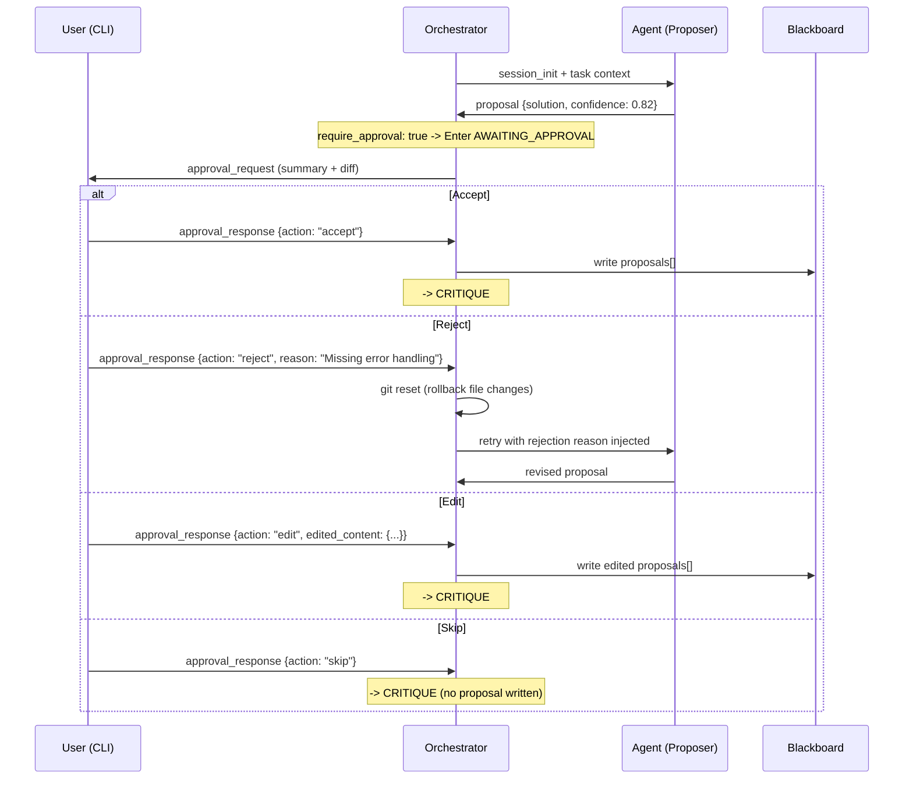
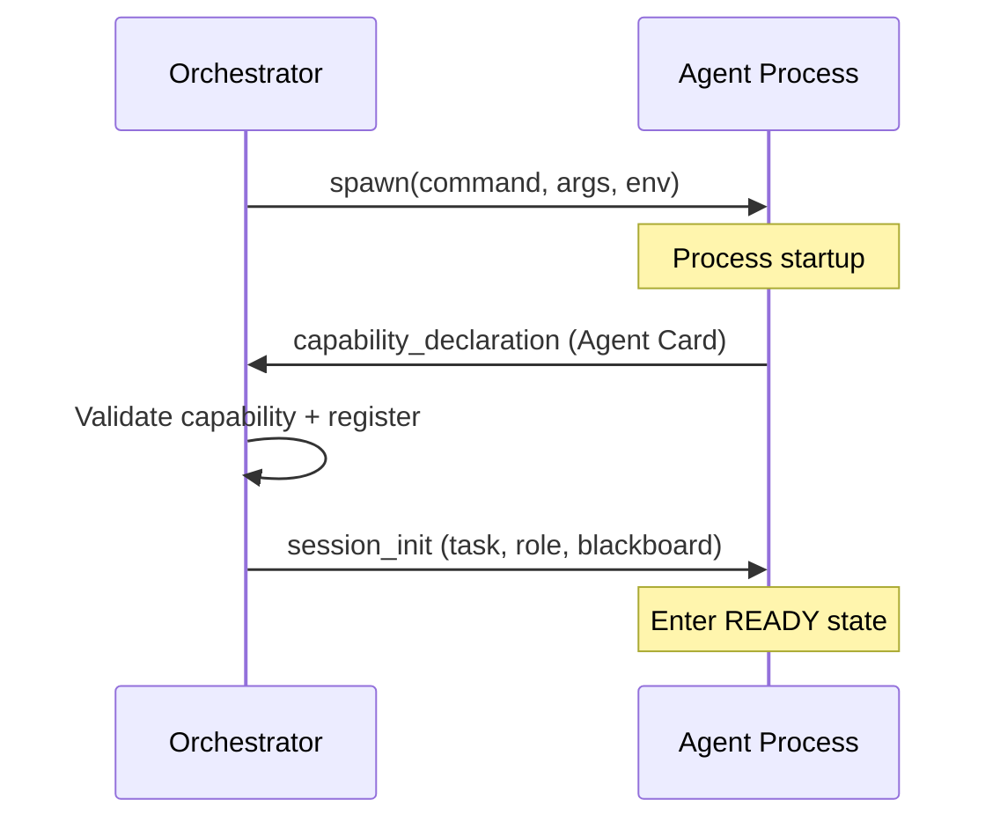
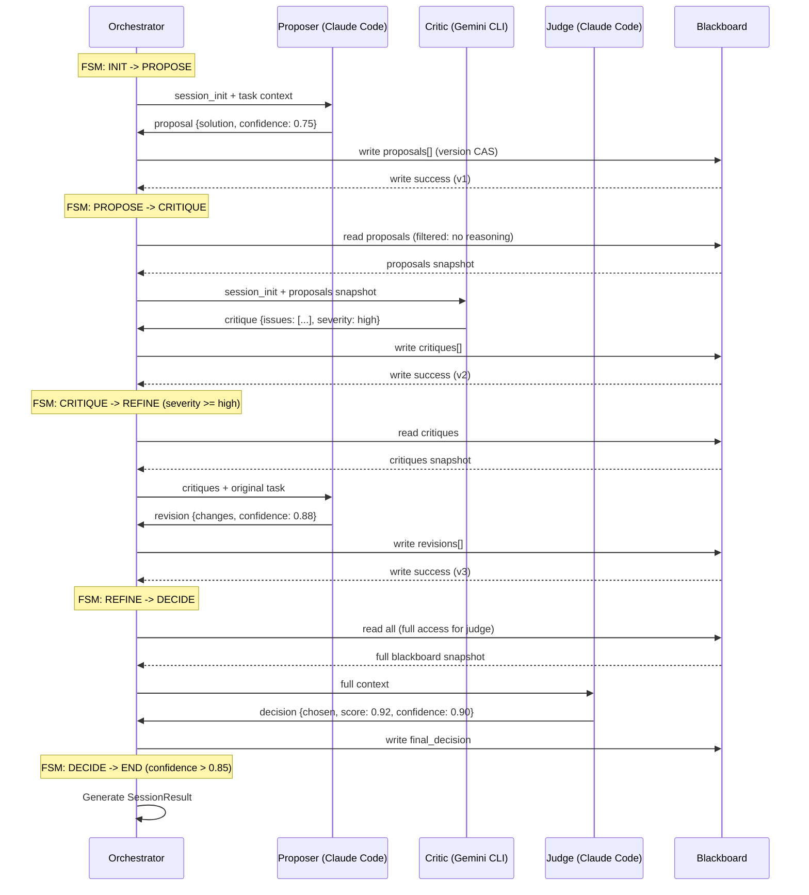
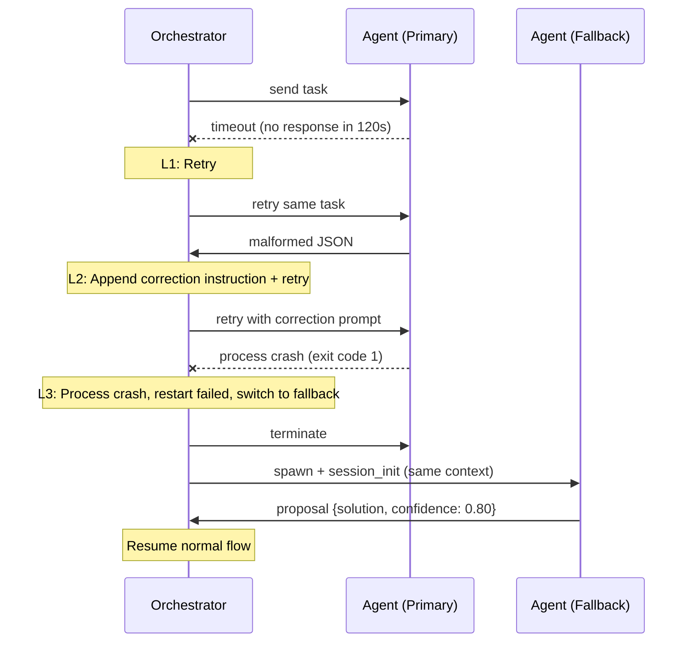
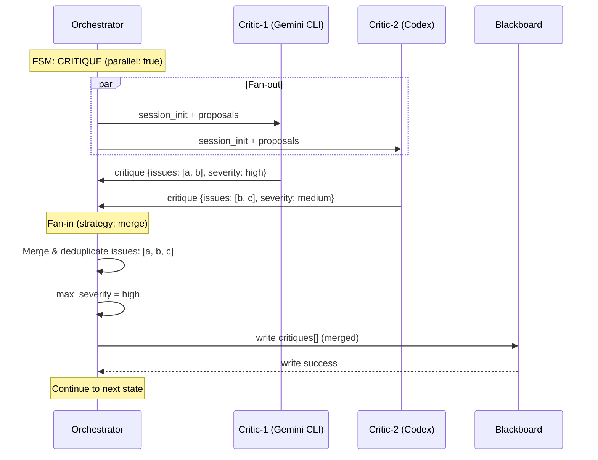

# Multi-Agent Collaboration System (Local Harness Orchestration Plan)

> Positioning: Technical design document for the local multi-agent runtime (Agent Runtime), responsible for Agent process management, message transport, and state synchronization.
> This document and the upper-layer harness orchestration plan form a layered relationship; this document focuses on the runtime base.

---

## 1. Goals

Build a locally controllable multi-agent collaboration system, under harness constraints, achieving:

- Multi-role collaboration (Proposer / Critic / Judge)
- Shared context + partial isolation
- Enforced structured output
- Configurable flow orchestration
- Controllable termination mechanisms
- Prevention of consensus drift (Groupthink)
- Observable, reproducible, extensible

### Technology Selection Decisions

| Decision | Choice | Rationale |
|------|------|------|
| Inter-Agent Communication | Custom protocol (not Google A2A) | Local subprocesses do not need HTTP; need fine-grained process lifecycle control; need cost-awareness |
| Transport Method | subprocess stdin/stdout | Simplest approach; CLI tools natively support it; no network overhead |
| Message Framing Format | NDJSON (Newline-Delimited JSON) | Human-readable; easy to debug; streaming-compatible |
| Orchestration Model | FSM (Finite State Machine) + config-driven | Predictable, debuggable, visualizable |
| Target Agents | Claude Code / Codex / Gemini CLI / OpenCode | Covers mainstream local AI coding tools |

---

## 2. System Architecture

### Layered Architecture

```
+-----------------------------------------------------------+
|  Layer 4: Flow Layer                                       |
|  FSM orchestration . Flow config . Termination . Role scheduling |
+-----------------------------------------------------------+
|  Layer 3: Protocol Layer                                    |
|  Message format . Message types . JSON Schema validation    |
+-----------------------------------------------------------+
|  Layer 2: Transport Layer                                   |
|  NDJSON over stdin/stdout . Heartbeat . Frame splitting     |
+-----------------------------------------------------------+
|  Layer 1: Adapter Layer                                     |
|  Claude Code . Codex . Gemini CLI . OpenCode process mgmt    |
+-----------------------------------------------------------+
```

### Component Relationships

```
            +------------------+
            |   Orchestrator   |
            |  (FSM Scheduler) |
            +--------+---------+
                     | dispatch / collect
    +----------------+----------------+
    |                |                |
    v                v                v
+--------+    +----------+    +--------+
|Proposer|    |  Critic  |    | Judge  |
|(propose)|   | (review) |    |(decide)|
+---+----+    +----+-----+    +---+----+
    |              |              |
    +--------------+--------------+
                   v
           +--------------+
           |  Blackboard  |
           | (shared state)|
           +------+-------+
                  v
           +--------------+
           |Memory System |
           +--------------+
```

### Interface Boundaries with Upper-Layer Harness

This document (runtime layer) is responsible for: process management, message transport, Blackboard read/write, L1-L3 error handling, resource limits.

The upper-layer harness is responsible for: task decomposition, `failure_policy`, `context.handoff`, `gate` (quality gate), L4 logic error handling.

The two layers interface through the Orchestrator's API: the harness delivers FlowConfig + TaskContext, the runtime executes and returns SessionResult.

---

## 3. Agent Adapter Layer

### 3.1 Adapter Abstract Interface

```typescript
interface IAgentAdapter {
  /** Launch agent subprocess */
  spawn(config: AgentAdapterConfig): Promise<AgentProcess>;

  /** Run mode: single-shot (short-lived) | long-running (persistent/MCP) */
  mode: "single-shot" | "long-running";

  /** Write message to agent stdin */
  send(process: AgentProcess, message: AgentMessage): Promise<void>;

  /** Read message stream from agent stdout */
  receive(process: AgentProcess): AsyncIterable<AgentMessage>;

  /** Terminate agent process */
  terminate(process: AgentProcess, graceful?: boolean): Promise<void>;
}
```

### 3.2 Performance Optimization: Persistent Session

To solve slow process startup and repeated context transmission in `single-shot` mode, the system prioritizes **MCP (Model Context Protocol)**:

1. **Process Reuse**: Within the same Session, the Orchestrator keeps the Agent process alive, conducting multiple rounds of dialogue via stdio.
2. **Incremental Context Updates**: Only send Blackboard delta changes since the previous round to the Agent, reducing Token consumption.
3. **Warm-up Mechanism**: When the FSM enters `INIT`, pre-warm `proposer` and `critic` processes in parallel.

#### 3.2.1 Long-Running Multi-Round Message Framing

In long-running mode, the same process receives multiple rounds of tasks. Use the `round_context` message to distinguish "new round" from "supplementary information":

```json
// New round start (distinct from session_init, no re-handshake needed)
{
  "type": "round_start",
  "session_id": "sess_abc123",
  "round": 2,
  "assigned_role": "proposer",
  "delta": { ... },
  "full_context": false
}
```

| Field | Description |
|------|------|
| `round` | Round number, incrementing; Agent uses this to recognize "this is a new task" |
| `delta` | Blackboard delta (see 3.2.2), contains only changes since the previous round |
| `full_context` | When `true`, carries a full Blackboard snapshot (used for state sync after process recovery) |

#### 3.2.2 Blackboard Delta Message Format

The delta for incremental updates describes Blackboard changes since the previous version:

```json
{
  "type": "blackboard_delta",
  "from_version": 2,
  "to_version": 3,
  "changes": [
    {
      "op": "append",
      "field": "critiques",
      "value": {
        "id": "msg_005",
        "role": "critic",
        "type": "critique",
        "content": { "issues": [...], "severity": "high", "summary": "..." },
        "confidence": 0.78
      }
    },
    {
      "op": "update",
      "field": "meta",
      "path": "confidence",
      "value": 0.78
    }
  ]
}
```

| op | Applicable Scenario | Description |
|----|----------|------|
| `append` | Append to array field | proposals / critiques / revisions |
| `set` | Replace field value | final_decision |
| `update` | Update nested path | Sub-fields within meta |

**Fallback Rules**: If an Agent is reactivated after a long idle period, or if the Delta chain is broken (`from_version` mismatch), the Orchestrator sends a full snapshot with `full_context: true` instead of a Delta.

---

## 4. Transport Protocol

### 4.1 Transport Layer Design and Robustness

| Property | Description |
|------|------|
| Transport method | subprocess stdin/stdout |
| Noise filtering | **Heuristic JSON Extractor** (see 4.1.1) |
| Enforced Headless | Inject instructions into System Prompt requiring Agent to output only single-line NDJSON. |
| Encoding | UTF-8 uniformly |

#### 4.1.1 Heuristic JSON Extractor

Agent CLI tool stdout is typically mixed with unstructured noise (ANSI color codes, version update notices, progress bars, debug logs, etc.). The extractor is responsible for reliably recovering structured JSON from this.

**Processing Pipeline**:

```
Raw stdout
  -> Step 1: Strip ANSI escape sequences (regex /x1B\[[0-9;]*[a-zA-Z]/g)
  -> Step 2: Split by newline (\n)
  -> Step 3: Try JSON.parse() on each line
  -> Step 4: If full-line parse succeeds -> output
  -> Step 5: If full-line parse fails -> bracket-matching extraction
  -> Step 6: If still fails -> log to trace, skip
```

**Bracket-Matching Extraction (Step 5) Rules**:

| Scenario | Handling |
|------|----------|
| Line contains a complete JSON object | Start from first `{`, use bracket counter (`depth++` on `{`, `depth--` on `}`), cut when `depth == 0`, extract substring and `JSON.parse()` |
| Line has multiple independent JSON objects | Extract first complete object, recursively process remainder |
| `{}` inside JSON strings | Track quote state during bracket matching (`"` toggle), `{}` inside strings not counted in depth |
| Escaped quotes `\"` | Recognize escape sequences, do not trigger toggle |
| Cross-line JSON (e.g. Agent output multi-line formatted JSON) | Accumulate buffer, append lines until brackets balanced or 1MB limit exceeded |

**ANSI Stripping Order**: Must be performed before JSON parsing. ANSI codes can appear in the middle of JSON values (e.g. `{"solution": "\x1B[32mfix\x1B[0m"}`), stripping first avoids parse errors.

**Failure Fallback**:

| Failure Case | Handling |
|----------|------|
| Single line cannot extract valid JSON | Log to trace log (`status: "noise"`), continue waiting for next line |
| N consecutive lines (default 50) with no valid JSON | Trigger L2 error, append correction instruction to Agent requiring pure JSON output |
| Exceed timeout with still no valid output | Trigger L1 timeout handling |

### 4.2 Message Framing Format

**NDJSON** (Newline-Delimited JSON): Each message is a single valid JSON line, terminated by `\n`.

```
{"id":"msg_001","type":"proposal","role":"proposer","content":{"solution":"..."},"confidence":0.8}\n
{"id":"msg_002","type":"critique","role":"critic","content":{"issues":["..."]},"confidence":0.7}\n
```

#### Boundary Conditions

| Constraint | Value | Description |
|------|----|------|
| Max single message size | 1MB | Reject message if exceeded, return L2 error and require Agent to simplify output |
| Newline handling | JSON serialization guarantees no bare newlines | `\n` inside strings encoded as `\\n` |
| Empty lines | Ignore | Allows heartbeat probe empty lines |
| Non-JSON lines | Log to trace, skip | Tolerates agent's unstructured output |

#### Alternative: Length-Prefix

```
[4 bytes: payload length, big-endian uint32][payload bytes]
```

Trade-off: More reliable (can handle binary), but harder to debug and not natively supported by CLI tools. **Not adopted for MVP phase**.

### 4.3 Handshake Protocol

For long-running mode (MCP Server stdio), the first message after Agent startup must be a `capability_declaration`:

```json
{
  "type": "capability_declaration",
  "agent": {
    "name": "claude-code",
    "model": "claude-sonnet-4-20250514",
    "supported_roles": ["proposer", "critic", "judge"],
    "max_output_tokens": 16000
  }
}
```

After validation, Orchestrator replies with `session_init`:

```json
{
  "type": "session_init",
  "session_id": "sess_abc123",
  "task": "Review the authentication module for security issues",
  "assigned_role": "critic",
  "blackboard_snapshot": { ... },
  "constraints": {
    "max_rounds": 5,
    "output_schema": "critique"
  }
}
```

- Handshake timeout: 10 seconds
- Handshake failure: follows L3 error handling (see Chapter 12)

For single-shot mode, handshake is not needed. Orchestrator concatenates session context + prompt and passes them as arguments.

### 4.4 Heartbeat and Liveness Detection

Only applicable for long-running mode:

| Parameter | Value |
|------|----|
| Heartbeat interval | 30 seconds |
| Heartbeat timeout | 10 seconds |
| Max consecutive failures | 3 |
| Detection method | `ping` / `pong` + `process.exitCode` dual detection |

```json
// Orchestrator -> Agent
{"type": "ping", "timestamp": "2026-04-03T10:00:00Z"}

// Agent -> Orchestrator
{"type": "pong", "timestamp": "2026-04-03T10:00:01Z"}
```

For single-shot mode, liveness is detected via process exit code + timeout.

---

## 5. Agent Registration and Capability Declaration (Agent Registry)

### 5.1 Agent Card Data Structure

```json
{
  "name": "claude-code",
  "version": "1.0.0",
  "model": "claude-sonnet-4-20250514",
  "provider": "anthropic",
  "supported_roles": ["proposer", "critic", "judge"],
  "capabilities": ["code_generation", "code_review", "reasoning", "web_search"],
  "tools": ["file_read", "file_write", "bash", "grep", "glob"],
  "constraints": {
    "max_context_window": 200000,
    "max_output_tokens": 16000,
    "supported_languages": ["zh", "en"]
  },
  "cost_profile": {
    "input_cost_per_1k_tokens": 0.003,
    "output_cost_per_1k_tokens": 0.015,
    "currency": "USD"
  },
  "latency_profile": {
    "avg_response_ms": 5000,
    "p99_response_ms": 30000
  }
}
```

### 5.2 Local Registry (agents.yaml)

```yaml
agents:
  claude-code:
    card:
      model: "claude-sonnet-4-20250514"
      provider: anthropic
      supported_roles: [proposer, critic, judge]
      capabilities: [code_generation, code_review, reasoning]
      cost_profile:
        input_cost_per_1k_tokens: 0.003
        output_cost_per_1k_tokens: 0.015
    adapter: claude-code  # references adapters config

  codex:
    card:
      model: "codex"
      provider: openai
      supported_roles: [proposer, critic]
      capabilities: [code_generation, code_review]
      cost_profile:
        input_cost_per_1k_tokens: 0.002
        output_cost_per_1k_tokens: 0.010
    adapter: codex

  gemini-cli:
    card:
      model: "gemini-2.5-pro"
      provider: google
      supported_roles: [proposer, critic]
      capabilities: [code_generation, reasoning, web_search]
      cost_profile:
        input_cost_per_1k_tokens: 0.001
        output_cost_per_1k_tokens: 0.004
    adapter: gemini-cli

  opencode:
    card:
      model: "configurable"
      provider: multiple
      supported_roles: [proposer, critic]
      capabilities: [code_generation]
      cost_profile:
        input_cost_per_1k_tokens: 0.002
        output_cost_per_1k_tokens: 0.010
    adapter: opencode
```

### 5.3 Agent Selection Strategy

Role-to-Agent mapping rules (by priority):

1. **Explicit Configuration** -- Directly specify `agent: claude-code` in FlowConfig
2. **Capability Matching** -- Auto-match based on `supported_roles` + `capabilities`
3. **Cost Optimization** -- Choose Agent with lower `cost_profile` when capabilities are equal
4. **Fallback Strategy** -- Switch to fallback when primary is unavailable

```yaml
# Mapping example in flow config
role_mapping:
  proposer:
    primary: claude-code
    fallback: [codex, gemini-cli]
  critic:
    primary: gemini-cli       # Heterogeneous model, prevents same-source bias
    fallback: [codex, opencode]
  judge:
    primary: claude-code
    fallback: [gemini-cli]
```

---

## 6. Core Protocol (Agent Protocol)

### 6.1 Message Format

```json
{
  "protocol_version": "1.0",
  "id": "msg_001",
  "session_id": "sess_abc123",
  "round": 1,
  "timestamp": "2026-04-03T10:00:00Z",
  "role": "proposer",
  "type": "proposal",
  "parent_id": null,
  "content": {},
  "confidence": 0.82,
  "terminate": false,
  "metadata": {
    "agent_name": "claude-code",
    "model": "claude-sonnet-4-20250514",
    "token_usage": {
      "input": 1200,
      "output": 800
    },
    "latency_ms": 3500
  }
}
```

### 6.2 Field Descriptions

| Field | Type | Required | Description |
|------|------|------|------|
| `protocol_version` | string | Yes | Protocol version, currently `"1.0"` |
| `id` | string | Yes | Unique message identifier, format `msg_xxx` |
| `session_id` | string | Yes | Session identifier, format `sess_xxx` |
| `round` | number | Yes | Current round, starting from 1 |
| `timestamp` | string | Yes | ISO 8601 timestamp |
| `role` | enum | Yes | `proposer` / `critic` / `judge` |
| `type` | enum | Yes | Message type (see 6.3) |
| `parent_id` | string? | No | Reply target message ID, supports comment-style threading |
| `content` | object | Yes | Message body, schema determined by type |
| `confidence` | number | Yes | 0.0-1.0, used for convergence judgment |
| `terminate` | boolean | Yes | Suggest ending current flow |
| `metadata` | object | No | Extensible metadata (token usage, latency, etc.) |

### 6.3 Complete Message Type Enumeration

#### System Messages (Sent by Orchestrator)

| type | Direction | Description |
|------|------|------|
| `session_init` | Orch -> Agent | Session initialization, carries task and context |
| `ping` | Orch -> Agent | Heartbeat probe |
| `terminate_request` | Orch -> Agent | Request termination |
| `error` | Bidirectional | Error notification |
| `approval_request` | Orch -> CLI | Request human approval (see 9.2.6) |
| `approval_response` | CLI -> Orch | Approval result (accept/reject/edit/skip) |
| `round_start` | Orch -> Agent | New round start in long-running mode (see 3.2.1) |
| `blackboard_delta` | Orch -> Agent | Blackboard incremental update (see 3.2.2) |

#### Handshake Messages (Long-Running Mode)

| type | Direction | Description |
|------|------|------|
| `capability_declaration` | Agent -> Orch | Agent capability declaration |
| `capability_ack` | Orch -> Agent | Capability acknowledgment |

#### Business Messages (Sent by Agent)

| type | content schema | Description |
|------|----------------|------|
| `proposal` | `{ solution: string, reasoning: string, alternatives?: string[] }` | Submit proposal |
| `critique` | `{ issues: Issue[], severity: "low"\|"medium"\|"high"\|"critical", summary: string }` | Critique / review |
| `revision` | `{ changes: string, addressed_issues: string[], reasoning: string }` | Revise proposal |
| `decision` | `{ chosen: string, rationale: string, score: number, dissent?: string }` | Final decision |

#### Response Messages

| type | Direction | Description |
|------|------|------|
| `pong` | Agent -> Orch | Heartbeat response |
| `terminate_ack` | Agent -> Orch | Termination acknowledgment |

### 6.4 Message Validation

Orchestrator validates each received message immediately:

1. **Format validation** -- Valid JSON, required fields present
2. **Type validation** -- `type` + `role` combination is legal (e.g. critic cannot send `proposal`)
3. **Schema validation** -- `content` matches the corresponding type's schema
4. **Permission validation** -- The agent is authorized to send this type of message

Validation failure handling: log to trace, follow L2 error handling (see Chapter 12).

---

## 7. Role Design (Role-based Agents)

### 7.1 Core Roles

| Role | Responsibility | Allowed Message Types |
|------|------|-------------|
| `proposer` | Submit proposals, respond to critiques, revise proposals | `proposal` / `revision` |
| `critic` | Find issues, assess risks, raise objections (must exist) | `critique` |
| `judge` | Comprehensive evaluation, make final decision | `decision` |

### 7.2 N:M Role-to-Agent Mapping

- One Agent can play multiple roles (e.g. Claude Code can be both proposer and judge)
- One role can be executed competitively by multiple Agents (e.g. two critics reviewing in parallel)
- In the same session, the same Agent should not simultaneously serve as proposer and critic (prevents self-review)

### 7.3 Role Switching Rules

Roles are assigned during `session_init` and are immutable within a session. When a different role is needed, start a new Agent process.

---

## 8. Blackboard (Shared State)

### 8.1 Data Structure

```json
{
  "task": {
    "description": "Review the authentication module for security issues",
    "context": {},
    "constraints": {}
  },
  "proposals": [],
  "critiques": [],
  "revisions": [],
  "final_decision": null,
  "meta": {
    "session_id": "sess_abc123",
    "round": 0,
    "confidence": 0.0,
    "created_at": "2026-04-03T10:00:00Z",
    "updated_at": "2026-04-03T10:00:00Z",
    "version": 0
  }
}
```

### 8.2 Write Constraints

| Agent | Writable Fields | Non-Writable Fields |
|-------|---------|-----------|
| proposer | `proposals` / `revisions` | `critiques` / `final_decision` |
| critic | `critiques` | `proposals` / `revisions` / `final_decision` |
| judge | `final_decision` | `proposals` / `critiques` / `revisions` |

Cross-field writes are forbidden; Orchestrator enforces this before writing.

### 8.3 Read Constraints (Context Isolation)

| Agent | Readable Fields | Non-Readable Fields |
|-------|---------|-----------|
| proposer | All | None |
| critic | `task` / `proposals` (results only) | proposer's `reasoning` field |
| judge | All | None |

The critic can only see the proposal results, not the reasoning process, to prevent being influenced by the proposer's arguments.

### 8.4 State Synchronization and Write Control

| Strategy | Description |
|------|------|
| Concurrency model | **Token-based Write + optimistic locking version check**: Only one Agent can write to the Blackboard's corresponding field at a time (mutual exclusion guaranteed by FSM scheduling); writes carry `expected_version` for version checking, preventing race conditions in parallel steps (fan-out). |
| Real-time broadcast | When Blackboard is updated, Orchestrator syncs snapshot in real time to all long-running (MCP) Agents. |

### 8.5 Scoring Mechanism

- critique messages carry `severity` (low / medium / high / critical)
- judge decision carries `score` (0.0-1.0)
- Blackboard `meta.confidence` is updated by Orchestrator based on latest score

---

## 9. Flow Orchestration

### 9.1 FSM State Machine

#### State Definitions

| State | Description |
|------|------|
| `INIT` | Load config, pre-warm Agent processes |
| `PROPOSE` | Proposer generates proposal |
| `CRITIQUE` | Critic reviews proposal |
| `REFINE` | Proposer revises based on Critique |
| `DECIDE` | Judge makes final decision |
| `AWAITING_APPROVAL` | Pause flow, wait for human approval |
| `END` | Flow ends, generate SessionResult |

#### State Transition Rules

```
INIT -> PROPOSE -> CRITIQUE -> REFINE (if severity >= threshold)
                             -> DECIDE (if severity < threshold)
REFINE -> CRITIQUE (loop) / DECIDE
DECIDE -> END (if confidence >= threshold)
        -> PROPOSE (new round, if confidence < threshold)

Any approvable state -> AWAITING_APPROVAL -> next state (Accept)
                                           -> same state (Edit, rerun with corrections)
                                           -> ROLLBACK -> same state (Reject, rollback and rerun)
```

### 9.2 Human-in-the-Loop

#### 9.2.1 Trigger Mechanism

Introduce `require_approval` configuration in flow steps, supporting three trigger modes:

| Mode | Config Value | Description |
|------|--------|------|
| Off | `false` (default) | Fully automatic execution |
| Post-step approval | `true` | Pause after Agent outputs result, before writing to Blackboard |
| File change approval | `"on_file_change"` | Trigger only when Agent modifies local file system |

```yaml
steps:
  - state: PROPOSE
    agent: proposer
    timeout_ms: 60000
    require_approval: true          # Every proposal requires approval

  - state: DECIDE
    agent: judge
    timeout_ms: 60000
    require_approval: "on_file_change"  # Only on file changes
```

#### 9.2.2 Approval Interaction Flow

When entering `AWAITING_APPROVAL` state, Orchestrator displays the approval UI via CLI:

```
+======================================================+
|  Approval Required -- PROPOSE (Round 2)              |
+======================================================+
|  Agent: claude-code (proposer)                       |
|  Confidence: 0.82                                    |
|                                                      |
|  Summary: Refactored auth middleware to use JWT       |
|                                                      |
|  Files Changed:                                      |
|    M src/auth/middleware.ts  (+42, -18)               |
|    A src/auth/jwt-validator.ts  (+67)                 |
|                                                      |
|  [D]iff  [A]ccept  [R]eject  [E]dit  [S]kip         |
+======================================================+
```

#### 9.2.3 User Actions and Subsequent Flow

| Action | Shortcut | Behavior | FSM Transition |
|------|--------|------|----------|
| **Diff** | `D` | Show full diff (when files changed) or Agent output details | Stay in `AWAITING_APPROVAL` |
| **Accept** | `A` | Accept result, write to Blackboard, continue | -> Next state |
| **Reject** | `R` | Reject result, rollback file changes (git checkpoint), send rejection reason to Agent for rerun | -> Rollback -> Rerun current step |
| **Edit** | `E` | Open `$EDITOR` for user to manually modify Agent output JSON or files, use modified result for Blackboard write | -> Next state |
| **Skip** | `S` | Skip current step, do not write to Blackboard | -> Next state |

#### 9.2.4 Approval Timeout

| Parameter | Default | Description |
|------|--------|------|
| `approval_timeout_ms` | `300000` (5 minutes) | Maximum wait time for user response |
| `approval_timeout_action` | `pause` | Default behavior on timeout |

Timeout behavior options:

| Behavior | Description |
|------|------|
| `pause` | Keep waiting, only print reminder (default) |
| `accept` | Auto-accept (suitable for low-risk steps) |
| `abort` | Terminate the entire session |

```yaml
steps:
  - state: PROPOSE
    agent: proposer
    require_approval: true
    approval_timeout_ms: 600000       # 10 minutes
    approval_timeout_action: pause    # Keep waiting after timeout
```

#### 9.2.5 Reject Retry Limit

| Parameter | Default | Description |
|------|--------|------|
| `max_rejections` | `3` | Max consecutive rejections for the same step |
| `on_max_rejections` | `abort` | Action when limit reached (`abort` / `skip`) |

When user consecutively rejects beyond the limit, Orchestrator terminates the current step to avoid infinite loops.

#### 9.2.6 Approval Protocol Messages

Two new system messages for recording the approval process:

```json
// Orchestrator -> CLI (request approval)
{
  "type": "approval_request",
  "session_id": "sess_abc123",
  "step_state": "PROPOSE",
  "round": 2,
  "agent_name": "claude-code",
  "result_preview": { "solution": "...", "confidence": 0.82 },
  "files_changed": [
    { "path": "src/auth/middleware.ts", "action": "modified", "additions": 42, "deletions": 18 }
  ],
  "timestamp": "2026-04-03T10:05:00Z"
}

// CLI -> Orchestrator (approval result)
{
  "type": "approval_response",
  "session_id": "sess_abc123",
  "action": "accept",
  "reason": null,
  "edited_content": null,
  "user": "yang.zhou",
  "timestamp": "2026-04-03T10:05:30Z"
}
```

`action` enum: `accept` | `reject` | `edit` | `skip`

When `action == "reject"`, `reason` is required and will be injected into the next round's Agent prompt:

```
The user rejected your previous output for the following reason:
"{reason}"
Please revise your approach and try again.
```

When `action == "edit"`, `edited_content` carries the user's modified content.

### 9.3 Basic YAML Configuration

```yaml
flow:
  name: "default-debate"
  max_rounds: 5

  steps:
    - state: PROPOSE
      agent: proposer
      timeout_ms: 60000

    - state: CRITIQUE
      agent: critic
      repeat: 2
      timeout_ms: 60000

    - state: REFINE
      agent: proposer
      condition: "critic_max_severity >= high"
      timeout_ms: 60000

    - state: DECIDE
      agent: judge
      timeout_ms: 60000

    - state: END
```

### 9.4 Concurrent Execution

#### Fan-out / Fan-in

Multiple agents execute the same step in parallel, results are aggregated before entering the next state:

```yaml
steps:
  - state: CRITIQUE
    parallel: true
    agents:
      - critic-1   # gemini-cli
      - critic-2   # codex
    fan_in: merge   # merge | vote | first
    timeout_ms: 90000
```

| fan_in Strategy | Description |
|-------------|------|
| `merge` | Merge all critiques into Blackboard |
| `vote` | Majority opinion decides (applicable for decision) |
| `first` | Use the first returned result |

#### Conditional Branching

```yaml
steps:
  - state: REFINE
    agent: proposer
    condition: "critic_max_severity >= high"
    # Skip when condition not met, go directly to next state
```

#### Loops

```yaml
steps:
  - state: CRITIQUE
    agent: critic
    repeat: 3                     # Max 3 repeats
    break_condition: "new_issues == 0"  # Exit early when no new issues
```

### 9.5 Complete FlowConfig Fields

```yaml
flow:
  name: string           # Flow name
  description: string    # Flow description
  max_rounds: number     # Hard limit: max rounds

  role_mapping:          # Role -> Agent mapping
    proposer:
      primary: string
      fallback: [string]
    critic:
      primary: string
      fallback: [string]
    judge:
      primary: string
      fallback: [string]

  termination:           # Termination conditions (see Chapter 11)
    max_rounds: number
    convergence_epsilon: number
    min_confidence: number

  steps:                 # Step list
    - state: string
      agent: string | [string]
      parallel: boolean
      fan_in: merge | vote | first
      repeat: number
      condition: string
      break_condition: string
      timeout_ms: number
      on_error: retry | skip | abort
      on_timeout: retry | skip | abort
      require_approval: boolean | "on_file_change"   # Human-in-the-Loop
      approval_timeout_ms: number                     # Approval timeout (default 300000)
      approval_timeout_action: pause | accept | abort # Timeout behavior (default pause)
      max_rejections: number                          # Max consecutive rejections (default 3)
      inquiry:                                        # Inquiry mode (CRITIQUE step only)
        enabled: boolean
        threshold: number                             # critic confidence threshold (default 0.5)
        max_rounds: number                            # Max inquiry rounds (default 1)
        release_fields: [string]                      # Isolated fields to release
```

### 9.6 Condition Expression Language

The `condition` and `break_condition` fields use a simple expression DSL evaluated inside the Orchestrator.

#### Available Variables

All variables are derived from the current Blackboard state:

| Variable | Type | Source | Description |
|--------|------|------|------|
| `round` | number | `blackboard.meta.round` | Current round |
| `confidence` | number | `blackboard.meta.confidence` | Current confidence |
| `critic_max_severity` | enum | Highest severity in latest round critiques | Comparable: `low < medium < high < critical` |
| `critic_issue_count` | number | Total issues in latest round critiques | -- |
| `new_issues` | number | New issue count compared to previous round | For convergence judgment |
| `score` | number | Latest decision score | -- |
| `score_delta` | number | `|score_t - score_(t-1)|` | Absolute score change |
| `proposals_count` | number | `blackboard.proposals.length` | -- |
| `revisions_count` | number | `blackboard.revisions.length` | -- |

#### Supported Operators

| Operator | Example | Description |
|--------|------|------|
| `==`, `!=` | `new_issues == 0` | Equals / not equals |
| `>`, `>=`, `<`, `<=` | `confidence >= 0.85` | Numeric comparison |
| `&&`, `\|\|` | `new_issues == 0 \|\| confidence > 0.90` | Logical AND / OR |
| `!` | `!terminate` | Logical NOT |

Severity enum comparison order: `low(1) < medium(2) < high(3) < critical(4)`.

#### Implementation

MVP phase uses a safe expression parser (such as [expr-eval](https://github.com/silentmatt/expr-eval)), **`eval()` usage is forbidden**. Function calls, property access, or arbitrary JavaScript are not supported.

### 9.7 HITL Sequence Diagram



---

## 10. Adapter Configuration (adapters.yaml)

Defines startup commands, arguments, and runtime environment for each Agent CLI tool.

### Schema

```yaml
adapters:
  <adapter_name>:
    command: string              # Executable file path or command name
    args: [string]               # Startup argument template
    mode: single-shot | long-running
    env:                         # Environment variables (supports ${VAR} referencing system env vars)
      KEY: value
    workdir: string              # Working directory (default ${PROJECT_ROOT})
    timeout_ms: number           # Single call timeout
    max_retries: number          # Retry count
    health_check_interval_ms: number  # Heartbeat interval (long-running only)
    system_prompt_override: string    # Override default system prompt (optional)
    resource_limits:
      max_memory_mb: number
      max_cpu_percent: number
```

### Default Configuration

```yaml
# configs/adapters.yaml
adapters:
  claude-code:
    command: "claude"
    args: ["--output-format", "json", "--model", "${MODEL}", "-p"]
    mode: single-shot
    env:
      ANTHROPIC_API_KEY: "${ANTHROPIC_API_KEY}"
    workdir: "${PROJECT_ROOT}"
    timeout_ms: 120000
    max_retries: 2

  codex:
    command: "codex"
    args: ["--approval-mode", "never", "--output-format", "json"]
    mode: single-shot
    env:
      OPENAI_API_KEY: "${OPENAI_API_KEY}"
    workdir: "${PROJECT_ROOT}"
    timeout_ms: 120000
    max_retries: 2

  gemini-cli:
    command: "gemini"
    args: ["-json"]
    mode: single-shot
    env:
      GOOGLE_API_KEY: "${GOOGLE_API_KEY}"
    workdir: "${PROJECT_ROOT}"
    timeout_ms: 120000
    max_retries: 2

  opencode:
    command: "opencode"
    args: ["--non-interactive", "--output", "json"]
    mode: single-shot
    env:
      OPENAI_API_KEY: "${OPENAI_API_KEY}"
    workdir: "${PROJECT_ROOT}"
    timeout_ms: 120000
    max_retries: 2
```

### Variable Substitution

`args` and `env` support `${VAR}` syntax, resolved in the following priority order:

1. `runtime_vars` in FlowConfig (passed at runtime)
2. System environment variables (`process.env`)
3. Error if unmatched (validated before startup)

---

## 11. Termination Mechanism

### Hard Termination (Required)

- `max_rounds` -- Force end when max rounds exceeded, prevents unlimited token consumption

### Soft Termination (Ends when any condition is met)

| Condition | Formula / Rule | Description |
|------|-------------|------|
| Score convergence | `|score_t - score_(t-1)| < epsilon` | Default epsilon = 0.05 |
| No new issues | `new_issues == 0` | Critic found no new issues |
| Judge high confidence | `judge.confidence > threshold` | Default threshold = 0.85 |
| Agent active termination | `terminate == true` | Any agent suggests termination |

### Termination Configuration Example

```yaml
termination:
  max_rounds: 5                # Hard termination
  convergence_epsilon: 0.05    # Score convergence threshold
  min_confidence: 0.85         # Judge minimum confidence
  allow_agent_terminate: true  # Allow agent to actively suggest termination
  min_rounds: 2                # Minimum execution rounds (prevents premature termination)
```

---

## 12. Error Handling & Rollback

### 12.1 File System Consistency: Git Checkpoint

To prevent Agent errors from polluting the project environment, Orchestrator takes a snapshot before each `PROPOSE` step:

1. **Create snapshot**: Automatically run `git stash push --include-untracked` or create a checkpoint on a temporary branch.
2. **Auto rollback**: Execute `git reset --hard` when:
    * `Judge` determines the proposal is seriously non-compliant.
    * A fatal logic error (L3/L4) occurs.
    * The user selects `Reject` during approval.

### 12.2 Error Classification

| Level | Type | Example | Handling | Responsible Layer |
|------|------|------|----------|--------|
| L1 | Transient error | API rate limit, network timeout | Auto retry (exponential backoff) | Runtime |
| L2 | Output error | JSON format error, schema mismatch | Prompt correction + retry | Runtime |
| L3 | Process error | Agent crash, OOM, process hang | Restart process + retry | Runtime |
| L4 | Logic error | Persistent low-quality output, hallucination | Replace Agent / human intervention | Upper harness |

### 12.3 Retry Strategy

```
delay = min(base_delay * 2^attempt, max_delay) + random_jitter
```

| Parameter | L1 | L2 | L3 |
|------|-----|-----|-----|
| `base_delay` | 1s | 2s | 5s |
| `max_delay` | 30s | 30s | 60s |
| `max_retries` | 5 | 3 | 2 |
| `jitter` | 0-1s | 0-2s | 0-5s |

On L2 retry, append correction instruction to prompt:

```
Your previous output was not valid JSON. Please respond with valid JSON only.
Previous error: [error details]
```

### 12.4 Degradation and Fallback

```
Primary Agent fails -> Retry N times
    | still fails
    v
Switch to fallback Agent (in role_mapping.fallback order)
    | all fallbacks fail
    v
Degradation mode: downgrade from multi-agent to single-agent execution
    | single agent also fails
    v
Escalate: Pause flow, notify user for intervention
```

### 12.5 Circuit Breaker

```
CLOSED --N consecutive failures--> OPEN --cooldown period ends--> HALF_OPEN
   ^                                    |                              |
   |                                    | reject all requests          |
   |                                    v                              |
   +---------- probe success ----------+                    Probe one request
                                                         Success -> CLOSED
                                                         Failure -> OPEN
```

| Parameter | Default |
|------|--------|
| Trigger threshold (consecutive failures) | 3 |
| Cooldown period | 60 seconds |
| Probe request count | 1 |

---

## 13. Preventing Groupthink (Consensus Drift)

### Layer 1: Context Isolation and Adaptive Visibility

- **Default isolation**: The critic by default does not see the proposer's reasoning process (the `reasoning` field is filtered), only sees proposal results.
- **Inquiry mode**: If critic confidence is below threshold, Orchestrator automatically triggers an inquiry step, releasing `reasoning` to the critic for auxiliary analysis.

#### Inquiry Mode Detailed Design

**Trigger conditions**:

| Parameter | Default | Description |
|------|--------|------|
| `inquiry_threshold` | `0.5` | Trigger inquiry when critic confidence is below this value |
| `max_inquiry_rounds` | `1` | Max inquiry rounds for the same CRITIQUE step |

**Trigger flow**:

```
CRITIQUE step completes
  -> Orchestrator checks critique.confidence
  -> If confidence < inquiry_threshold:
      1. Release proposer's reasoning field to critic
      2. Send inquiry instruction to critic (with reasoning + original critique)
      3. Critic produces supplementary critique (may update severity / add new issues)
      4. Merge into Blackboard (merge with original critique, take highest severity)
  -> If confidence >= inquiry_threshold:
      -> Normal transition to next state
```

**Inquiry Instruction Prompt**:

```
Your initial review had low confidence ({confidence}).
Here is the proposer's reasoning for additional context:

{proposer_reasoning}

Please re-evaluate your critique with this additional information.
You may update severity, add new issues, or confirm your original assessment.
```

**FSM Configuration**:

Inquiry mode is a built-in behavior of the CRITIQUE step, controlled via flow config:

```yaml
steps:
  - state: CRITIQUE
    agent: critic
    timeout_ms: 60000
    inquiry:                        # Inquiry mode config (optional)
      enabled: true                 # Default false
      threshold: 0.5                # critic confidence threshold
      max_rounds: 1                 # Max inquiry rounds
      release_fields: ["reasoning"] # Which isolated fields to release
```

No separate FSM state is needed -- inquiry is a sub-loop within the CRITIQUE state, managed internally by the Orchestrator.

**TypeScript type**:

```typescript
interface InquiryConfig {
  enabled: boolean;
  threshold: number;
  max_rounds: number;
  release_fields: string[];
}
```

`FlowStep` gains an optional field `inquiry?: InquiryConfig`.

### Layer 2: Perturbation Mechanisms

- Temperature jitter -- each call randomly +/- 0.1
- Prompt-injected anti-bias instructions:

```
You MUST identify at least one potential issue.
Do NOT agree with the proposal simply because it sounds reasonable.
Consider edge cases, failure modes, and alternative approaches.
```

### Layer 3: Model Heterogeneity

- Proposer and critic must use different models/providers
- Avoid same-source hallucination (e.g. Claude proposes, Gemini critiques)
- Enforced via `role_mapping` configuration

---

## 14. Memory System

### Relationship with Blackboard

- **Blackboard** = Real-time shared state within a single session, archived after session ends
- **Memory** = Cross-session persistent knowledge, retrievable by future sessions

### Layered Design

#### 1. Short-Term Memory (Session Memory)

- Complete message history of current session
- Storage: SQLite (single file, no external dependencies)
- Lifecycle: Archived as trace log after session ends

#### 2. Medium-Term Memory (Working Memory)

- Task summaries of last N sessions
- Storage: Vector database (local embedding)
- Retrieval: Semantic similarity matching
- Retention policy: Latest 100 sessions, FIFO eviction beyond that

#### 3. Long-Term Memory (Knowledge Memory)

```json
{
  "pattern": "Authentication modules often have CSRF vulnerabilities",
  "solution": "Add CSRF token validation middleware",
  "confidence": 0.9,
  "usage_count": 10,
  "last_used": "2026-04-01T10:00:00Z"
}
```

### Memory Extraction Strategy

| Trigger Condition | Stored To | Description |
|----------|--------|------|
| Session ends | Session -> Working | Auto-summarize and store |
| High-quality result (score > 0.85) | Working -> Knowledge | Extract as reusable pattern |
| High-frequency issue (usage_count > 5) | Boost weight in Knowledge | Increase retrieval priority |
| Explicit pattern | Write directly to Knowledge | Marked by judge |

---

## 15. Self-Evolution System

### 15.1 Design Goals

The system can automatically learn from historical session failures, optimize Prompts, adjust flow parameters, and improve Agent selection strategy, achieving **continuous evolution without manual intervention**.

### 15.2 Evolution Loop

```
Session execution
  -> Trace Log + Blackboard archive
  -> Evolution engine analysis (failure patterns / performance bottlenecks / cost anomalies)
  -> Generate evolution actions (Prompt adjustments / parameter tuning / strategy updates)
  -> Write to Evolution Store
  -> Load evolution context on new Session startup
  -> Validate evolution effects (compare against baseline)
  -> Keep if successful, rollback if failed
```

### 15.3 Prompt Auto-Evolution (Prompt Evolution)

#### 15.3.1 Failure-Pattern-Driven Prompt Adjustment

When an Agent repeatedly fails on specific types of tasks, the system automatically appends targeted instructions to the System Prompt.

**Trigger Conditions:**

| Condition | Threshold | Description |
|------|------|------|
| Same-type failure count | >= 3 | Same error type within same task_type |
| Failure concentration | Within 7 days | Avoid triggering on sporadic failures |
| Minimum confidence | < 0.5 | Judge score continuously low |

**Evolution Mechanism:**

```json
{
  "evolution_id": "evo_001",
  "type": "prompt_evolution",
  "target_role": "critic",
  "trigger": {
    "task_type": "security_review",
    "failure_pattern": "missed_csrf_vulnerability",
    "occurrence_count": 3,
    "time_window_days": 7
  },
  "action": {
    "type": "append_instruction",
    "content": "When reviewing authentication or session management code, ALWAYS check for CSRF token validation. Common patterns to look for: missing csrf middleware, token not validated on state-changing endpoints, same-site cookie attribute not set.",
    "position": "after_main_rules"
  },
  "validation": {
    "metric": "critique_coverage_score",
    "baseline": 0.45,
    "target": 0.70,
    "evaluation_sessions": 5
  },
  "status": "active",
  "created_at": "2026-04-03T10:00:00Z"
}
```

**Prompt Injection Position:**

```
{original_system_prompt}

{additional_context}

--- Auto-Evolved Instructions (do not remove) ---
{evolved_instructions}
```

#### 15.3.2 Prompt Version Management and Rollback

| Operation | Description |
|------|------|
| Create new version | Each evolution generates a new prompt version (v1 -> v2 -> ...) |
| A/B validation | New prompt compared against baseline in first 5 sessions |
| Auto rollback | Automatically revert to previous version if new prompt performs worse |
| Manual override | User can view/edit/disable evolution rules via CLI |

**Rollback Trigger Conditions:**

| Condition | Description |
|------|------|
| Score drop > 10% | New prompt's Judge score significantly lower than baseline |
| Cost increase > 20% | Abnormal token consumption increase |
| New error types appear | Failure patterns introduced that did not previously exist |

### 15.4 FlowConfig Auto-Tuning (Parameter Optimization)

#### 15.4.1 Tunable Parameters

| Parameter | Tuning Direction | Basis |
|------|----------|------|
| `max_rounds` | Increase / decrease | Average convergence rounds in historical sessions |
| `convergence_epsilon` | Increase / decrease | Judge score fluctuation range |
| `min_confidence` | Increase / decrease | Final decision pass rate vs quality |
| `timeout_ms` | Increase / decrease | Agent response latency P95 |
| `inquiry.threshold` | Increase / decrease | Inquiry mode effectiveness |
| `fan_in` strategy | Switch | Merge effectiveness in parallel reviews |

#### 15.4.2 Tuning Algorithm

Lightweight implementation using **Bayesian Optimization + Multi-Armed Bandit**:

```
1. Initialize parameter search space (min/max for each parameter)
2. After each session, record (params, outcome)
3. Every N sessions, run one tuning cycle:
   a. Calculate expected reward for each parameter combination
   b. Select the combination with highest expected reward
   c. Apply new parameters, continue observing
4. Reward function:
   score = w1 * quality + w2 * efficiency + w3 * cost_efficiency
   where:
     quality = Judge score
     efficiency = 1 / (rounds * avg_latency)
     cost_efficiency = 1 / total_cost
```

**Default weights:** `w1=0.5, w2=0.3, w3=0.2`, adjustable via config.

#### 15.4.3 Tuning Configuration

```yaml
auto_tuning:
  enabled: true
  evaluation_window: 10        # Tune once every 10 sessions
  min_sessions_before_tuning: 5  # At least 5 sessions before tuning starts
  max_param_change_percent: 30   # Max single-tuning change range (prevents drastic fluctuations)

  weights:
    quality: 0.5
    efficiency: 0.3
    cost_efficiency: 0.2

  parameter_bounds:
    max_rounds: { min: 2, max: 10 }
    convergence_epsilon: { min: 0.01, max: 0.15 }
    min_confidence: { min: 0.70, max: 0.95 }
    timeout_ms: { min: 30000, max: 300000 }
```

### 15.5 Agent Selection Learning (Agent Selection Learning)

#### 15.5.1 Performance Profiles

The system maintains performance profiles for each Agent on each task type:

```json
{
  "agent_performance": {
    "claude-code": {
      "security_review": {
        "sessions_count": 15,
        "avg_score": 0.88,
        "avg_confidence": 0.82,
        "avg_cost_usd": 0.045,
        "avg_latency_ms": 3500,
        "failure_rate": 0.07,
        "common_failures": ["timeout_on_large_codebase"],
        "strengths": ["deep_reasoning", "security_patterns"],
        "weaknesses": ["slow_on_large_context"]
      },
      "architecture_design": {
        "sessions_count": 8,
        "avg_score": 0.91,
        "avg_confidence": 0.85,
        "avg_cost_usd": 0.062,
        "avg_latency_ms": 5200,
        "failure_rate": 0.0,
        "strengths": ["system_thinking", "trade_off_analysis"],
        "weaknesses": []
      }
    }
  }
}
```

#### 15.5.2 Intelligent Role Mapping

When `role_mapping` is not explicitly configured, the system auto-selects the optimal Agent based on performance profiles:

```
Given task type T and role R:
  1. Filter all Agents supporting role R
  2. Query each Agent's performance profile for task type T
  3. Calculate composite score:
     score = avg_score * 0.4 + (1 - failure_rate) * 0.3 + cost_efficiency * 0.2 + (1/latency_normalized) * 0.1
  4. Select highest-scoring Agent as primary
  5. Second-highest as fallback
```

#### 15.5.3 Cold Start Strategy

When no historical data exists for a new Agent or new task type:

| Phase | Strategy | Description |
|------|------|------|
| Cold start | Round-robin allocation | Allocate 2-3 sessions to each Agent for data collection |
| Data accumulation | epsilon-greedy | 90% select current best, 10% explore other Agents |
| Mature | Fully profile-driven | Switch to profile-driven after data > 10 |

### 15.6 Failure Pattern Knowledge Base

#### 15.6.1 Failure Pattern Classification

| Level | Type | Classification Dimension | Example |
|------|------|----------|------|
| L2 | Output error | Format error / Schema mismatch / Missing field | "Agent output wrapped in markdown code fence" |
| L3 | Process error | Timeout / OOM / Crash / Abnormal exit code | "Process killed by OOM when handling large files" |
| L4 | Logic error | Hallucination / Low quality / Bias / Omission | "Critic missed SQL injection vulnerability" |

#### 15.6.2 Failure Pattern Data Structure

```json
{
  "failure_id": "fail_0042",
  "category": "L4",
  "type": "missed_vulnerability",
  "subtype": "sql_injection",
  "agent": "gemini-cli",
  "role": "critic",
  "task_type": "security_review",
  "description": "Critic failed to identify SQL injection vulnerability in raw query construction",
  "context": {
    "code_pattern": "string_interpolation_in_query",
    "file_type": "typescript",
    "framework": "express"
  },
  "root_cause": "Agent focused on business logic, overlooked data access layer",
  "fix_applied": {
    "type": "prompt_evolution",
    "evolution_id": "evo_003",
    "instruction_added": "Always check data access layer for injection vulnerabilities..."
  },
  "recurrence_count": 1,
  "first_seen": "2026-04-01T10:00:00Z",
  "last_seen": "2026-04-01T10:00:00Z",
  "resolved": true,
  "resolution": "Prompt evolution evo_003 applied, verified in 3 subsequent sessions"
}
```

#### 15.6.3 Preventive Injection

On new Session startup, the system retrieves relevant patterns from the failure pattern knowledge base based on task type and injects preventive instructions:

```
Retrieval conditions:
  1. task_type matches
  2. status == "active" (unresolved or verified effective)
  3. recurrence_count >= 1

Injection format:
--- Known Issues to Watch For ---
Based on {N} previous sessions of this type:
1. {failure_description} -> Prevention: {prevention_instruction}
2. ...
```

#### 15.6.4 Failure Pattern Lifecycle

```
First discovered -> Record to knowledge base -> Classify and tag -> Apply fix
  -> Verification period (5 sessions)
    -> Not reoccurred -> Mark as "resolved"
    -> Reoccurred -> recurrence_count++, escalate fix strategy
    -> Exceeded 5 times -> Mark as "persistent", trigger human review
```

### 15.7 Evolution Store

#### 15.7.1 Storage Structure

```
evolution/
├── prompts/                          # Prompt evolution
│   ├── {role}_v1.json               # Original version
│   ├── {role}_v2.json               # Evolution version 1
│   └── {role}_v3.json               # Evolution version 2
├── params/                           # Parameter tuning history
│   ├── tuning_log.ndjson            # Each tuning record
│   └── current_params.json          # Current optimal parameters
├── agent_profiles/                   # Agent performance profiles
│   ├── claude-code.json
│   ├── gemini-cli.json
│   └── codex.json
├── failure_patterns/                 # Failure pattern knowledge base
│   ├── active/                       # Active patterns
│   ├── resolved/                     # Resolved patterns
│   └── persistent/                   # Persistent issues (requires human intervention)
└── evolution_log.ndjson              # Complete evolution log (for auditing)
```

#### 15.7.2 Evolution Log Format

```json
{
  "evolution_id": "evo_005",
  "type": "parameter_tuning",
  "trigger": "evaluation_window",
  "changes": [
    { "param": "max_rounds", "from": 5, "to": 4, "reason": "avg_convergence_at_round_3.2" },
    { "param": "convergence_epsilon", "from": 0.05, "to": 0.03, "reason": "score_delta_observed" }
  ],
  "expected_impact": { "quality_delta": 0.02, "cost_delta": -0.15 },
  "status": "applied",
  "applied_at": "2026-04-03T12:00:00Z",
  "evaluated_at": null,
  "result": null
}
```

### 15.8 Evolution Effect Validation

#### 15.8.1 Validation Metrics

| Metric | Calculation | Goal |
|------|----------|------|
| Quality improvement | Moving average of Judge score | Continuously rising or stable |
| Efficiency improvement | Average rounds * average latency | Continuously decreasing |
| Cost efficiency | Token cost per unit quality | Continuously decreasing |
| Failure rate | L2/L3/L4 error proportion | Continuously decreasing |
| Evolution success rate | Proportion of retained evolution actions | > 70% |

#### 15.8.2 Degradation Detection

| Condition | Action |
|------|------|
| Quality drops > 10% for 3 consecutive sessions | Pause evolution, rollback to most recent stable version |
| Failure rate suddenly rises > 20% | Trigger alert, mark most recent evolution as suspicious |
| Cost rises > 30% without quality improvement | Rollback parameter tuning, increase cost_efficiency weight |

### 15.9 Human Governance

The evolution system is not fully autonomous; human governance channels are preserved:

| Operation | Method | Description |
|------|------|------|
| View evolution history | `vera evolution list` | List all evolution actions and status |
| Review evolution rules | `vera evolution show {id}` | View detailed information for a specific evolution |
| Disable evolution rules | `vera evolution disable {id}` | Pause a specific evolution rule |
| Manually add rules | `vera evolution add` | Manually write evolution rules |
| Reset evolution state | `vera evolution reset` | Rollback to initial configuration |
| Export evolution report | `vera evolution report` | Generate evolution effect analysis report |

### 15.10 Relationship with Memory System

| System | Responsibility | Relationship |
|------|------|------|
| Memory System | Store and retrieve historical knowledge | Provides raw data (session summaries, patterns) |
| Evolution System | Analyze data and generate evolution actions | Consumes memory data, produces executable optimizations |
| Failure Pattern KB | Structurally record failure experience | Core input source for evolution system |
| Agent Profiles | Quantify Agent performance | Decision basis for evolution system |

```
Session ends
  -> Memory System: Summarize -> Store
  -> Evolution Engine:
      Read memory data
      Analyze failure patterns
      Update Agent profiles
      Evaluate parameter effects
      Generate evolution actions
      Validate and apply
  -> New Session: Load evolution context -> Execute
```

---

## 16. Security & Permissions

### 16.1 Blackboard Access Control

See Section 8.2 (Write Constraints) and Section 8.3 (Read Constraints). Orchestrator enforces checks before every read/write operation.

### 16.2 File System Access Control

| Agent | Working Directory | Readable Paths | Writable Paths |
|-------|---------|---------|---------|
| proposer | `${PROJECT_ROOT}` | Entire project directory | Project source directory |
| critic | `${PROJECT_ROOT}` (readonly) | Entire project directory | None (read-only) |
| judge | `${PROJECT_ROOT}` (readonly) | Entire project directory | None (read-only) |

Leverage Agent built-in sandbox capabilities:
- Claude Code: `--allowedTools` restrict tool set
- Codex: sandbox mode (network isolation + directory isolation)
- Other Agents: OS-level permission control (read-only mount workdir)

### 16.3 Key and Credential Management

| Rule | Description |
|------|------|
| API Keys injected via environment variables | Not written to config files, not appearing in logs |
| Agent process environment variables isolated from each other | Each Agent only sees its own Key |
| Blackboard forbids storing sensitive information | Orchestrator intercepts and redacts |
| Trace Log auto-redaction | Regex match API Key format and replace with `***` |

### 16.4 Resource Limits

```yaml
resource_limits:
  per_agent:
    max_token_per_call: 50000       # Token cap per single call
    max_memory_mb: 2048             # Process memory cap
    max_cpu_percent: 80             # CPU usage cap

  per_session:
    max_total_tokens: 500000        # Token cap for entire session
    max_total_cost_usd: 5.00        # Cost cap for entire session
    max_duration_minutes: 30        # Time cap for entire session

  per_day:
    max_total_cost_usd: 50.00      # Daily cost cap
```

Exceeded limit handling: Trigger soft termination; Orchestrator requires Judge to make a final decision based on current state.

---

## 17. Observability

### 17.1 Trace Log

```json
{
  "session_id": "sess_abc123",
  "step": 3,
  "round": 1,
  "agent_name": "gemini-cli",
  "role": "critic",
  "state": "CRITIQUE",
  "input_preview": "Review the following proposal...",
  "output_preview": "Found 2 issues: ...",
  "input_tokens": 1200,
  "output_tokens": 800,
  "cost_usd": 0.0024,
  "latency_ms": 3500,
  "status": "success",
  "timestamp": "2026-04-03T10:01:30Z"
}
```

### 17.2 Replay Capability

- Each session's complete message sequence is stored as an NDJSON file
- Full flow reproduction supported (same input + same config -> comparable output differences)
- Storage path: `sessions/{session_id}/trace.ndjson`

### 17.3 Visualization

```
[INIT] -> [PROPOSE: claude-code, 3.5s, $0.02]
       -> [CRITIQUE: gemini-cli, 2.1s, $0.01]
       -> [CRITIQUE: codex, 4.2s, $0.02]
       -> [REFINE: claude-code, 3.8s, $0.02]
       -> [DECIDE: claude-code, 2.0s, $0.01]
       -> [END: total 15.6s, $0.08, 3 issues found, score 0.92]
```

### 17.4 Cost Tracking

| Dimension | Statistics |
|------|--------|
| Per message | input_tokens, output_tokens, cost_usd |
| Per Agent | Cumulative tokens / cost / call count |
| Per role | Cumulative tokens / cost |
| Per Session | Total tokens / total cost / average cost per round |
| Per day | Total cost / total sessions |

Cost exceedance warning: Write warn log when approaching 80% of `resource_limits.per_session.max_total_cost_usd`.

---

## 18. Agent System Prompt Templates

When Orchestrator invokes an Agent, it injects the corresponding System Prompt based on the role. Below are the core instruction templates for each role.

### Proposer Prompt

```
You are acting as a PROPOSER in a multi-agent debate system.

Your task: {task.description}

Constraints:
- You MUST respond with a single-line JSON object matching this schema: {output_schema}
- Do NOT output anything other than the JSON object -- no explanations, no markdown, no code fences.
- Include your reasoning in the "reasoning" field.
- Set "confidence" between 0.0 and 1.0 to reflect how confident you are in your solution.
- If you believe the task is fully resolved, set "terminate": true.

{additional_context}
```

### Critic Prompt

```
You are acting as a CRITIC in a multi-agent debate system.

Your task: Review the following proposal and identify issues, risks, and potential improvements.

Proposal to review:
{proposal_content}

Rules:
- You MUST respond with a single-line JSON object matching this schema: {output_schema}
- You MUST identify at least one potential issue. Do NOT agree simply because the proposal sounds reasonable.
- Consider edge cases, failure modes, security implications, and alternative approaches.
- Rate each issue with severity: low / medium / high / critical.
- Set "confidence" to reflect how thorough your review was.
- Do NOT output anything other than the JSON object.

{additional_context}
```

### Judge Prompt

```
You are acting as a JUDGE in a multi-agent debate system.

Your task: Evaluate the proposals, critiques, and revisions below, then make a final decision.

{full_blackboard_context}

Rules:
- You MUST respond with a single-line JSON object matching this schema: {output_schema}
- Choose the best solution and explain your rationale in "rationale".
- Assign a "score" between 0.0 and 1.0.
- If there are unresolved dissenting opinions, capture them in "dissent".
- Be objective. Weigh evidence from both proposer and critic.
- Do NOT output anything other than the JSON object.
```

### Rejection Retry Prompt (appended to original prompt)

```
The user rejected your previous output for the following reason:
"{rejection_reason}"

Please revise your approach and try again. Address the user's concern directly.
```

---

## 19. CLI User Interaction Design

### Starting a Session

```bash
# Start with specified flow config
vera run --flow configs/flows/code-review.yaml --task "Review auth module"

# Start with minimal config
vera run --flow minimal --task "Fix login bug"

# Pass runtime variables
vera run --flow code-review.yaml --task "..." --var MODEL=claude-sonnet-4-20250514
```

### Runtime Interaction

| Shortcut | Description |
|--------|------|
| `Ctrl+C` | Graceful termination: Trigger `terminate_request` to all Agents, wait for `terminate_ack`, save trace |
| `Ctrl+C` x2 | Force termination: Immediately kill all child processes, save existing trace |
| `p` | Pause: Pause scheduling, in-progress Agents continue until return |
| `r` | Resume: Resume scheduling |
| `s` | Status: Print current FSM state, round, cost |

### Session Graceful Termination Flow

```
User presses Ctrl+C
  -> Orchestrator sets terminating = true
  -> Send terminate_request to all active Agents
  -> Wait for terminate_ack (timeout 10s)
  -> Agents not responding within timeout: SIGTERM -> wait 5s -> SIGKILL
  -> Rollback uncommitted file changes (git checkpoint restore)
  -> Save current Blackboard snapshot + Trace Log
  -> Output Session Summary (rounds, cost, termination reason)
  -> Exit
```

---

## 20. Protocol Versioning

### Message-Level Versioning

Each message carries a `protocol_version` field:

```json
{
  "protocol_version": "1.0",
  "id": "msg_001",
  "type": "proposal",
  ...
}
```

### Compatibility Rules

| Version Change | Handling |
|----------|----------|
| Same major version (e.g. 1.0 -> 1.1) | Backward compatible, ignore unknown fields |
| Different major version (e.g. 1.x -> 2.x) | Reject during handshake, require upgrade |

### Blackboard Snapshot Persistence

To prevent session data loss due to process crashes, Blackboard is asynchronously persisted after each write:

```
sessions/{session_id}/blackboard.json     # Latest snapshot
sessions/{session_id}/blackboard.wal.ndjson  # Write-ahead log (WAL)
```

Crash recovery: Rebuild state from the latest `blackboard.json` + un-persisted entries in `blackboard.wal.ndjson`.

---

## 21. TypeScript Type Definitions

### protocol.ts

```typescript
/** Message role */
type AgentRole = "proposer" | "critic" | "judge";

/** Business message type */
type BusinessMessageType = "proposal" | "critique" | "revision" | "decision";

/** System message type */
type SystemMessageType =
  | "session_init"
  | "ping"
  | "pong"
  | "terminate_request"
  | "terminate_ack"
  | "error"
  | "capability_declaration"
  | "capability_ack"
  | "approval_request"
  | "approval_response"
  | "round_start"
  | "blackboard_delta";

/** Issue severity */
type IssueSeverity = "low" | "medium" | "high" | "critical";

/** Single issue in a critique */
interface Issue {
  id: string;
  description: string;
  severity: IssueSeverity;
  location?: string;
  suggestion?: string;
}

/** Content schema for each business message */
interface ProposalContent {
  solution: string;
  reasoning: string;
  alternatives?: string[];
}

interface CritiqueContent {
  issues: Issue[];
  severity: IssueSeverity;
  summary: string;
}

interface RevisionContent {
  changes: string;
  addressed_issues: string[];
  reasoning: string;
}

interface DecisionContent {
  chosen: string;
  rationale: string;
  score: number;
  dissent?: string;
}

/** File change description */
interface FileChange {
  path: string;
  action: "added" | "modified" | "deleted";
  additions?: number;
  deletions?: number;
}

/** Approval request */
interface ApprovalRequest {
  type: "approval_request";
  session_id: string;
  step_state: FSMStateName;
  round: number;
  agent_name: string;
  result_preview: Record<string, unknown>;
  files_changed: FileChange[];
  timestamp: string;
}

/** Approval response */
interface ApprovalResponse {
  type: "approval_response";
  session_id: string;
  action: "accept" | "reject" | "edit" | "skip";
  reason?: string;
  edited_content?: Record<string, unknown>;
  user: string;
  timestamp: string;
}

/** Token usage */
interface TokenUsage {
  input: number;
  output: number;
}

/** Message metadata */
interface MessageMetadata {
  agent_name: string;
  model: string;
  token_usage?: TokenUsage;
  latency_ms?: number;
}

/** Business message (Agent -> Orchestrator) */
interface BusinessMessage {
  protocol_version: string;
  id: string;
  session_id: string;
  round: number;
  timestamp: string;
  role: AgentRole;
  type: BusinessMessageType;
  parent_id: string | null;
  content: ProposalContent | CritiqueContent | RevisionContent | DecisionContent;
  confidence: number;
  terminate: boolean;
  metadata?: MessageMetadata;
}

/** System message */
interface SystemMessage {
  type: SystemMessageType;
  session_id?: string;
  timestamp: string;
  payload?: Record<string, unknown>;
}

/** Unified message type */
type AgentMessage = BusinessMessage | SystemMessage;
```

### agent.ts

```typescript
/** Agent capability declaration (Agent Card) */
interface AgentCard {
  name: string;
  version: string;
  model: string;
  provider: string;
  supported_roles: AgentRole[];
  capabilities: string[];
  tools?: string[];
  constraints: {
    max_context_window: number;
    max_output_tokens: number;
    supported_languages: string[];
  };
  cost_profile: {
    input_cost_per_1k_tokens: number;
    output_cost_per_1k_tokens: number;
    currency: string;
  };
  latency_profile: {
    avg_response_ms: number;
    p99_response_ms: number;
  };
}

/** Adapter run mode */
type AdapterMode = "single-shot" | "long-running";

/** Adapter configuration */
interface AgentAdapterConfig {
  name: string;
  command: string;
  args: string[];
  mode: AdapterMode;
  env: Record<string, string>;
  workdir: string;
  timeout_ms: number;
  max_retries: number;
  health_check_interval_ms?: number;
  resource_limits?: {
    max_memory_mb: number;
    max_cpu_percent: number;
  };
}

/** Agent process state */
type AgentProcessState =
  | "init"
  | "starting"
  | "ready"
  | "running"
  | "idle"
  | "errored"
  | "recovering"
  | "terminated";

/** Agent process handle */
interface AgentProcess {
  id: string;
  adapter_name: string;
  pid: number;
  state: AgentProcessState;
  assigned_role: AgentRole;
  started_at: string;
  last_activity_at: string;
}

/** Health check status */
interface HealthStatus {
  alive: boolean;
  state: AgentProcessState;
  last_heartbeat: string | null;
  consecutive_failures: number;
}
```

### blackboard.ts

```typescript
/** Blackboard task description */
interface BlackboardTask {
  description: string;
  context: Record<string, unknown>;
  constraints: Record<string, unknown>;
}

/** Blackboard metadata */
interface BlackboardMeta {
  session_id: string;
  round: number;
  confidence: number;
  created_at: string;
  updated_at: string;
  version: number;
}

/** Blackboard complete state */
interface BlackboardState {
  task: BlackboardTask;
  proposals: BusinessMessage[];
  critiques: BusinessMessage[];
  revisions: BusinessMessage[];
  final_decision: BusinessMessage | null;
  meta: BlackboardMeta;
}

/** Blackboard writable fields */
type BlackboardWritableField = "proposals" | "critiques" | "revisions" | "final_decision";

/** Write constraint mapping */
const WRITE_PERMISSIONS: Record<AgentRole, BlackboardWritableField[]> = {
  proposer: ["proposals", "revisions"],
  critic: ["critiques"],
  judge: ["final_decision"],
};

/** Blackboard write request */
interface BlackboardWriteRequest {
  field: BlackboardWritableField;
  expected_version: number;
  value: BusinessMessage;
  writer_role: AgentRole;
}

/** Blackboard write result */
type BlackboardWriteResult =
  | { success: true; new_version: number }
  | { success: false; error: "permission_denied" | "version_conflict" | "validation_error"; message: string };
```

### flow.ts

```typescript
/** FSM state name */
type FSMStateName = "INIT" | "PROPOSE" | "CRITIQUE" | "REFINE" | "DECIDE" | "AWAITING_APPROVAL" | "END" | string;

/** Fan-in strategy */
type FanInStrategy = "merge" | "vote" | "first";

/** Error handling strategy */
type ErrorStrategy = "retry" | "skip" | "abort";

/** Approval trigger mode */
type ApprovalMode = boolean | "on_file_change";

/** Approval timeout action */
type ApprovalTimeoutAction = "pause" | "accept" | "abort";

/** Flow step definition */
interface FlowStep {
  state: FSMStateName;
  agent?: string;
  agents?: string[];
  parallel?: boolean;
  fan_in?: FanInStrategy;
  repeat?: number;
  condition?: string;
  break_condition?: string;
  timeout_ms?: number;
  on_error?: ErrorStrategy;
  on_timeout?: ErrorStrategy;
  require_approval?: ApprovalMode;
  approval_timeout_ms?: number;
  approval_timeout_action?: ApprovalTimeoutAction;
  max_rejections?: number;
  inquiry?: InquiryConfig;
}

/** Role mapping */
interface RoleMapping {
  primary: string;
  fallback: string[];
}

/** Termination config */
interface TerminationConfig {
  max_rounds: number;
  convergence_epsilon?: number;
  min_confidence?: number;
  allow_agent_terminate?: boolean;
  min_rounds?: number;
}

/** Complete flow configuration */
interface FlowConfig {
  name: string;
  description?: string;
  max_rounds: number;
  role_mapping: Record<AgentRole, RoleMapping>;
  termination: TerminationConfig;
  steps: FlowStep[];
}
```

### session.ts

```typescript
/** Session status */
type SessionStatus = "pending" | "running" | "completed" | "failed" | "aborted";

/** Session configuration */
interface SessionConfig {
  flow: FlowConfig;
  adapters: Record<string, AgentAdapterConfig>;
  agents: Record<string, { card: AgentCard; adapter: string }>;
  resource_limits: {
    per_agent: { max_token_per_call: number; max_memory_mb: number; max_cpu_percent: number };
    per_session: { max_total_tokens: number; max_total_cost_usd: number; max_duration_minutes: number };
  };
}

/** Trace entry */
interface TraceEntry {
  session_id: string;
  step: number;
  round: number;
  agent_name: string;
  role: AgentRole;
  state: FSMStateName;
  input_preview: string;
  output_preview: string;
  input_tokens: number;
  output_tokens: number;
  cost_usd: number;
  latency_ms: number;
  status: "success" | "error" | "timeout" | "skipped";
  error_message?: string;
  timestamp: string;
}

/** Session result */
interface SessionResult {
  session_id: string;
  status: SessionStatus;
  blackboard: BlackboardState;
  traces: TraceEntry[];
  summary: {
    total_rounds: number;
    total_tokens: number;
    total_cost_usd: number;
    total_duration_ms: number;
    termination_reason: string;
  };
}
```

---

## 22. Project Directory Structure

```
multi-agent-mvp/
├── docs/
│   ├── mvp.prd.md                    # This document
│   ├── decisions/                     # ADR (Architecture Decision Records)
│   │   └── 001-custom-protocol.md
│   └── examples/                      # Runnable examples
│       ├── code-review.yaml
│       ├── architecture-decision.yaml
│       └── bug-diagnosis.yaml
├── src/
│   ├── types/                         # TypeScript type definitions
│   │   ├── protocol.ts
│   │   ├── agent.ts
│   │   ├── blackboard.ts
│   │   ├── flow.ts
│   │   ├── session.ts
│   │   └── index.ts
│   ├── adapters/                      # Agent adapters
│   │   ├── base.ts                    # IAgentAdapter interface
│   │   ├── claude-code.ts
│   │   ├── codex.ts
│   │   ├── gemini-cli.ts
│   │   └── opencode.ts
│   ├── transport/                     # Transport layer
│   │   ├── ndjson-stream.ts           # NDJSON encoding/decoding
│   │   ├── subprocess.ts             # Subprocess management
│   │   └── heartbeat.ts              # Heartbeat detection
│   ├── orchestrator/                  # Orchestration engine
│   │   ├── fsm.ts                    # State machine
│   │   ├── scheduler.ts             # Step scheduler
│   │   └── orchestrator.ts          # Main orchestrator
│   ├── blackboard/
│   │   ├── blackboard.ts            # Blackboard implementation
│   │   ├── lock.ts                  # Concurrency lock
│   │   └── validator.ts             # Schema validation
│   ├── error/
│   │   ├── retry.ts                 # Retry strategy
│   │   ├── circuit-breaker.ts       # Circuit breaker
│   │   └── fallback.ts              # Fallback strategy
│   ├── registry/
│   │   └── registry.ts              # Agent registry
│   ├── security/
│   │   ├── permission.ts            # Permission validation
│   │   └── sanitizer.ts             # Log sanitization
│   ├── memory/
│   │   ├── session-memory.ts        # Short-term memory
│   │   ├── working-memory.ts        # Medium-term memory
│   │   └── knowledge-memory.ts      # Long-term memory
│   ├── observability/
│   │   ├── tracer.ts                # Trace Log
│   │   ├── cost-tracker.ts          # Cost tracking
│   │   └── replay.ts               # Replay engine
│   └── index.ts                     # Entry point
├── configs/
│   ├── agents.yaml                   # Agent registry
│   ├── adapters.yaml                # Adapter config
│   └── flows/
│       ├── code-review.yaml
│       ├── architecture-decision.yaml
│       └── bug-diagnosis.yaml
├── sessions/                         # Session data (runtime generated)
│   └── {session_id}/
│       ├── trace.ndjson
│       ├── blackboard.json
│       ├── blackboard.wal.ndjson     # Blackboard WAL (for crash recovery)
│       └── result.json
├── package.json
├── tsconfig.json
└── AGENTS.md                         # Agent-readable entry document
```

---

## 23. Sequence Diagrams

### 23.1 Agent Startup and Registration (Long-Running Mode)



### 23.2 Complete Collaboration Cycle (Happy Path)



### 23.3 Error Recovery



### 23.4 Parallel Execution (Fan-out / Fan-in)



---

## 24. Complete Configuration Examples

### Scenario 1: Code Review Debate

```yaml
# configs/flows/code-review.yaml
flow:
  name: "code-review-debate"
  description: "Multi-agent code review: proposer submits solution, two critics review in parallel, judge makes final decision"
  max_rounds: 4

  role_mapping:
    proposer:
      primary: claude-code
      fallback: [codex]
    critic:
      primary: gemini-cli
      fallback: [opencode]
    judge:
      primary: claude-code
      fallback: [gemini-cli]

  termination:
    max_rounds: 4
    convergence_epsilon: 0.05
    min_confidence: 0.85
    min_rounds: 2

  steps:
    - state: PROPOSE
      agent: proposer
      timeout_ms: 60000
      on_error: retry
      on_timeout: retry
      require_approval: "on_file_change"   # Human approval on file changes

    - state: CRITIQUE
      parallel: true
      agents:
        - gemini-cli
        - codex
      fan_in: merge
      timeout_ms: 90000
      on_error: skip        # One critic failing does not block
      on_timeout: skip

    - state: REFINE
      agent: proposer
      condition: "critic_max_severity >= high"
      timeout_ms: 60000
      on_error: retry

    - state: DECIDE
      agent: judge
      timeout_ms: 60000
      on_error: retry
      require_approval: true               # Final decision requires human confirmation

    - state: END
```

### Scenario 2: Architecture Decision (Competing Proposals)

```yaml
# configs/flows/architecture-decision.yaml
flow:
  name: "architecture-decision"
  description: "Two proposers submit competing proposals, critic reviews each, judge compares and decides"
  max_rounds: 3

  role_mapping:
    proposer:
      primary: claude-code
      fallback: [gemini-cli]
    critic:
      primary: codex
      fallback: [opencode]
    judge:
      primary: claude-code
      fallback: [gemini-cli]

  termination:
    max_rounds: 3
    min_confidence: 0.80

  steps:
    # Two proposers submit in parallel
    - state: PROPOSE
      parallel: true
      agents:
        - claude-code
        - gemini-cli
      fan_in: merge
      timeout_ms: 90000

    # Unified review
    - state: CRITIQUE
      agent: codex
      repeat: 2
      break_condition: "new_issues == 0"
      timeout_ms: 60000

    # Judge compares two proposals + critique results
    - state: DECIDE
      agent: judge
      timeout_ms: 60000

    - state: END
```

### Scenario 3: Bug Diagnosis (Convergent)

```yaml
# configs/flows/bug-diagnosis.yaml
flow:
  name: "bug-diagnosis"
  description: "Proposer suggests diagnostic hypotheses, critic refutes, multiple rounds converge to high confidence"
  max_rounds: 6

  role_mapping:
    proposer:
      primary: claude-code
      fallback: [codex]
    critic:
      primary: gemini-cli
      fallback: [codex]
    judge:
      primary: claude-code
      fallback: [gemini-cli]

  termination:
    max_rounds: 6
    convergence_epsilon: 0.03
    min_confidence: 0.90
    min_rounds: 2
    allow_agent_terminate: true

  steps:
    - state: PROPOSE
      agent: proposer
      timeout_ms: 60000

    - state: CRITIQUE
      agent: critic
      timeout_ms: 60000

    - state: REFINE
      agent: proposer
      condition: "critic_max_severity >= medium"
      timeout_ms: 60000

    # Loop CRITIQUE -> REFINE until convergence
    - state: CRITIQUE
      agent: critic
      repeat: 3
      break_condition: "new_issues == 0 || confidence > 0.90"
      timeout_ms: 60000

    - state: DECIDE
      agent: judge
      timeout_ms: 60000

    - state: END
```

---

## 25. MVP Scope

### 25.1 MVP Scope (v0.1)

#### Must-Have (P0)

- [x] Agent Protocol message format + TypeScript type definitions
- [x] At least 2 Agent Adapters (Claude Code + one other Agent)
- [x] NDJSON Transport (single-shot mode)
- [x] Basic FSM Orchestrator (linear flow)
- [x] Blackboard (in-memory implementation, with write constraints)
- [x] Max rounds termination
- [x] YAML FlowConfig loading

#### Nice-to-Have (P1)

- [ ] Human-in-the-Loop (`require_approval` approval flow)
- [ ] 3rd and 4th Agent Adapters
- [ ] Heartbeat detection (long-running mode)
- [ ] Error retry (L1-L2)
- [ ] Parallel steps (fan-out / fan-in)
- [ ] Trace Log + Cost tracking

#### Future (P2)

- [ ] Circuit Breaker
- [ ] Agent degradation and replacement
- [ ] Memory system
- [ ] Replay engine
- [ ] Security permission model
- [ ] Vector database memory retrieval
- [ ] Self-evolution system (Prompt evolution / Parameter tuning / Agent profiling)
- [ ] Failure pattern knowledge base

### 25.2 MVP Implementation Priority

| Week | Goal | Deliverables |
|-----|------|--------|
| Week 1 | Types + Transport + Basic orchestration | types/, transport/ndjson-stream.ts, adapters/claude-code.ts + one other adapter, orchestrator/fsm.ts, blackboard/blackboard.ts |
| Week 2 | Error handling + Complete adapters | error/retry.ts, heartbeat.ts, remaining adapters, validator.ts |
| Week 3 | Concurrency + Observability + Security | scheduler.ts (parallel), tracer.ts, cost-tracker.ts, permission.ts |

### 25.3 MVP Minimal Runnable Configuration

```yaml
# Minimal config: single proposer + single critic + judge
flow:
  name: "minimal"
  max_rounds: 3
  role_mapping:
    proposer: { primary: claude-code, fallback: [] }
    critic: { primary: gemini-cli, fallback: [] }
    judge: { primary: claude-code, fallback: [] }
  termination:
    max_rounds: 3
    min_confidence: 0.85
  steps:
    - state: PROPOSE
      agent: proposer
      timeout_ms: 60000
    - state: CRITIQUE
      agent: critic
      timeout_ms: 60000
    - state: DECIDE
      agent: judge
      timeout_ms: 60000
    - state: END
```

---

## 26. Evolution Roadmap

### v1 (Current Target)

- [x] Agent Protocol + TypeScript type definitions
- [x] FSM Scheduler
- [x] Blackboard (in-memory + write constraints)
- [x] 2+ Agent Adapters (subprocess single-shot)
- [x] NDJSON Transport
- [x] Basic termination mechanism
- [x] Trace Log
- [ ] Basic error retry

### v2

- [ ] Human-in-the-Loop full implementation (approval flow + CLI interaction)
- [ ] Pluggable Agents (dynamic Adapter loading)
- [ ] Long-running mode (MCP Server stdio)
- [ ] Tool call proxy (browser / API / file system)
- [ ] Full permission control implementation
- [ ] Memory system (Session + Working Memory)
- [ ] Circuit Breaker + degradation
- [ ] Parallel execution (fan-out / fan-in)
- [ ] Replay engine
- [ ] Blackboard WAL persistence + crash recovery

### v3

- [ ] Multi-task concurrency (multiple sessions in parallel)
- [ ] Agent Runtime (standalone service)
- [ ] Knowledge Memory (vector retrieval)
- [ ] AI OS kernelization (deep integration with harness)
- [ ] Web UI (visual orchestration + real-time monitoring)
- [ ] Cross-machine scheduling (optional HTTP/A2A)

### v4 (Self-Evolution)

- [ ] Failure pattern knowledge base (Failure Pattern KB)
- [ ] Prompt auto-evolution engine
- [ ] FlowConfig parameter auto-tuning (Bayesian optimization)
- [ ] Agent performance profiling and intelligent selection
- [ ] Evolution effect validation + degradation detection
- [ ] CLI evolution governance commands (list / show / disable / reset)

---

## 27. Key Risks

| # | Risk | Impact | Mitigation |
|---|------|------|----------|
| 1 | No protocol -> System uncontrollable | Agent output unpredictable, cannot automate processing | Enforce JSON Schema validation + L2 error handling |
| 2 | No structure -> Cannot automate | Blackboard data inconsistency | Write constraints + optimistic locking |
| 3 | No termination -> Unlimited token consumption | Cost spiraling | Hard termination max_rounds + cost cap |
| 4 | No observability -> Cannot debug | Issues hard to diagnose | Trace Log + Replay |
| 5 | Unstable CLI interfaces | Agent CLI tool version updates break Adapters | Adapter abstraction isolation + version pinning + adaptation tests |
| 6 | Large output format differences | Different Agents have varying JSON structuring capabilities | Enforce prompt constraints + output validation + retry correction |
| 7 | Cost spiraling | Multi-agent parallel + multi-round retry leads to token consumption explosion | Resource limits + cost tracking + early warning |
| 8 | Human approval blocking | User not responding for long periods causes session hang | Approval timeout + configurable timeout behavior (pause/accept/abort) |
| 9 | Rejection infinite loop | User repeatedly rejects but Agent cannot improve | `max_rejections` limit + auto-terminate on exceeded limit |
| 10 | Crash loses state | Process crash causes Blackboard and Trace data loss | Blackboard WAL persistence + Trace real-time writing |

---

## 28. Summary

This system is essentially:

> An "orchestrable, multi-role, structured-output" local multi-agent runtime (Agent Runtime),
> driving Claude Code / Codex / Gemini CLI / OpenCode collaboration through subprocess + NDJSON custom protocol.

Core success factors:

| Factor | Corresponding Chapter |
|------|---------|
| Adapter Layer | Chapter 3 |
| Transport Protocol | Chapter 4 |
| Agent Registry | Chapter 5 |
| Agent Protocol | Chapter 6 |
| FSM + Human-in-the-Loop (HITL) | Chapter 9 |
| Adapter Configuration (adapters.yaml) | Chapter 10 |
| Blackboard | Chapter 8 |
| Error Handling | Chapter 12 |
| Preventing Groupthink | Chapter 13 |
| Memory System | Chapter 14 |
| Self-Evolution System | Chapter 15 |
| Security & Permissions | Chapter 16 |
| Observability | Chapter 17 |
| System Prompt Templates | Chapter 18 |
| CLI User Interaction | Chapter 19 |
| Protocol Versioning | Chapter 20 |
